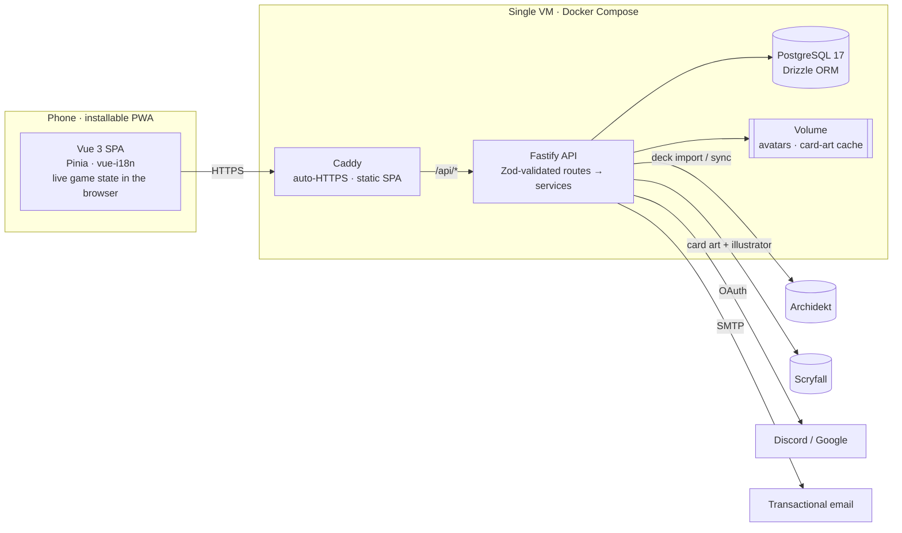

# Contributing

Svey follows **GitHub flow**: `main` is always deployable, and every change reaches it through a pull request. Merging to `main` deploys to [svey.app](https://svey.app).


To run the app locally, start with [Getting started](#getting-started) below. The rest of this guide covers how changes reach `main`, how the code is laid out, and how it ships.

## Getting started

You need **Node 26** (pinned in [`.nvmrc`](.nvmrc), the version CI and the Docker images use), **pnpm** and **Docker** (for Postgres). No OAuth keys or Archidekt account are required: the seed creates a demo pod you can sign into with email and password.

```sh
nvm use                         # or install Node 26 another way
corepack enable                 # installs the pnpm version pinned in package.json
pnpm install

cp apps/api/.env.example apps/api/.env
cp apps/frontend/.env.example apps/frontend/.env

pnpm dev                        # Postgres in Docker, migrations, demo seed, then API on :3000 + app on http://localhost:5173
```

Sign in with **`demo@example.com`** / **`svey-demo`**.

Notes:
- New email sign-ups work too. Without SMTP settings, the verification link is printed to the API console.
- Discord and Google login need a client ID and secret in `apps/api/.env`.
- Always use pnpm, never npm or yarn: CI installs from the single root `pnpm-lock.yaml` with `--frozen-lockfile`.
- A longer walkthrough (what `pnpm dev` does, ports, troubleshooting) is in [docs/onboarding/03-local-setup.md](docs/onboarding/03-local-setup.md).

<details>
<summary>All scripts</summary>

| Command | What it does |
|---|---|
| `pnpm dev` | Start Postgres, apply migrations, seed demo data (first run only), then run API (watch mode) and frontend (Vite) together |
| `pnpm build` | Type-check and build both apps |
| `pnpm test` | API tests (`node:test`) and frontend tests (Vitest) |
| `pnpm test:e2e` | Playwright end-to-end suite against a freshly seeded `svey_e2e` database (needs `pnpm db:up`) |
| `pnpm lint:check` / `pnpm lint` | oxlint + ESLint (`lint` auto-fixes) |
| `pnpm check-types` | `tsc` for the API, `vue-tsc` for the frontend |
| `pnpm db:up` / `db:down` / `db:reset` | Start, stop, or wipe the local Postgres container |
| `pnpm db:migrate` | Apply pending migrations from `apps/api/db/migrations/` |
| `pnpm --filter api seed` | Insert the demo data (no-op if it already exists) |
| `pnpm --filter api db:studio` | Browse the database in Drizzle Studio |

</details>

## The cycle

```
main ──●──────────────●──────────────●──  (each ● = one squash-merged PR, deployed)
        \            /
         feat/xyz ──●──●──   PR · CI · squash merge
```

1. **Branch off `main`.** Use a prefix that matches the change type: `feat/…`, `fix/…`, `chore/…`, `docs/…`, `refactor/…`, `test/…`, `ci/…`. For example: `fix/tracker-center-bar`.
2. **Commit as often as you like** on the branch. Branch commits are squashed away, so they don't need to be polished.
3. **Open a pull request** early; a draft is fine. Fill in the template.
4. **Wait for the required checks.** Both must pass:
   - **CI**: lint, type-check, tests and a production build (`pnpm lint:check && pnpm check-types && pnpm test && pnpm build` reproduces it locally).
   - **Conventional PR title**: see below.
5. **Squash-merge.** The PR title becomes the single commit on `main`, and the branch is deleted automatically.
6. **The merge deploys.** `main` is built, pushed to GHCR and rolled out. Database migrations run automatically when the API starts.

`main` is protected: no direct pushes, no force-pushes, and history stays linear.

## PR titles (Conventional Commits)

Because PRs are squash-merged, the **title** is what lands on `main`, so it must be a [Conventional Commit](https://www.conventionalcommits.org/). release-please reads those titles to build the changelog and decide the next version:

| Title | Changelog | Version bump |
|---|---|---|
| `feat(tracker): persist life totals across reloads` | Features | minor (1.**1**.0) |
| `fix(api): return 413 for oversized avatars` | Bug Fixes | patch (1.0.**1**) |
| `perf: …`, `refactor: …`, `revert: …` | listed | patch |
| `docs: …`, `test: …`, `build: …`, `ci: …`, `chore: …` | hidden | none on their own |
| `feat!: …` or a `BREAKING CHANGE:` footer | highlighted | major (**2**.0.0) |

Notes:
- The scope is optional. Use the area you touched: `tracker`, `decks`, `pods`, `auth`, `i18n`, `api`, `deps`, …
- Start the subject in lower case and use the imperative ("add", "fix", not "added").

## Releases

[release-please](https://github.com/googleapis/release-please) keeps a **release PR** open (`chore(main): release x.y.z`). Every merge to `main` updates it with:
- the new `CHANGELOG.md` entries
- the version bump in all three `package.json` files

release-please turns the merged PR titles into [`CHANGELOG.md`](CHANGELOG.md) and versioned [releases](https://github.com/Holytrashbag/svey/releases). Merge the release PR whenever you want to cut a version. That tags `vX.Y.Z` and publishes the release notes on GitHub. Versions document what shipped; they don't gate deploys, since every merge already deploys.

> The release PR is opened with the workflow's built-in token, and GitHub doesn't run workflows for PRs created that way. Its required checks never report. Merge it with **"Merge without waiting for requirements"** (an admin bypass). It only touches the changelog and version numbers.

## Testing

```sh
pnpm test
```

- **Frontend:** game rules, relative-time bucketing, and locale completeness.
- **API:** token encryption, bracket estimation, error handling, and HTTP smoke tests that boot the full app.

Neither unit suite needs a database. The API tests read a committed, non-secret [`apps/api/.env.test`](apps/api/.env.test). CI runs lint, type-checks, tests and a production build on pull requests and on pushes to `main`.

[End-to-end tests](#end-to-end-tests) are covered in the next section: Playwright drives the built app in Chromium at phone width (360px) against the real API and a freshly seeded Postgres database, covering sign-in, a full game through the survey, retiring and cancelling. Pull requests run it in CI too.

## End-to-end tests

The Playwright suite in [`apps/frontend/e2e/`](apps/frontend/e2e) drives the real app the way a player uses it: the built SPA, the API and Postgres, in Chromium at a 360px-wide phone viewport.

```sh
pnpm db:up && pnpm test:e2e
```

That's all a fresh checkout needs (plus Docker). Each run:

1. drops, recreates, migrates and seeds a separate **`svey_e2e`** database on the docker-compose Postgres. Your dev database (`svey`) is never touched, and the reset refuses any database name that doesn't end in `_e2e`;
2. starts the API on **:3100** ([`apps/api/.env.e2e`](apps/api/.env.e2e)) and serves a production build with `vite preview` on **:4174** ([`apps/frontend/.env.e2e`](apps/frontend/.env.e2e)). Both ports must be free;
3. runs the specs. Each spec creates its own pod through the API, so specs don't depend on each other.

Both `.env.e2e` files are committed on purpose: like `apps/api/.env.test`, they hold dummy values only.

Useful variations (from `apps/frontend`):
- `pnpm test:e2e --ui` or `pnpm test:e2e --headed` to watch the browser.
- `pnpm exec playwright show-report` to open the HTML report after a failure (traces and screenshots included).
- On Linux/WSL, if Chromium is missing system libraries: `pnpm exec playwright install --with-deps chromium` (needs sudo).

Writing specs:
- Import `test`/`expect` from [`e2e/fixtures.ts`](apps/frontend/e2e/fixtures.ts). Every test starts signed in as the demo user (Alex) and can ask for a fresh `pod` that Jordan has joined. Drivers for game setup live in `e2e/helpers/game.ts`.
- Locate by role and accessible name using the English copy from `src/i18n/locales/en`. If a control has no accessible name, give it an `aria-label` through `t()` rather than adding a test id.
- The suite never leaves localhost: external requests are aborted and the card-art endpoints (`/api/cards/**`) are stubbed.

In CI, the **End-to-end (Playwright)** job runs on pull requests with a Postgres service container and uploads the `playwright-report` artifact when it fails. It isn't a required check yet.

## Architecture



- **Monorepo** (Turborepo + pnpm) with two apps: [`apps/frontend`](apps/frontend) and [`apps/api`](apps/api).
- **The SPA and API share one origin.** Every endpoint lives under `/api`, so Caddy serves the SPA and proxies the API with no CORS in production.
- **The game runs in the browser.** Setup is stored in `localStorage`, the tracker works without a connection, and the finished game is sent to the API in a single request once the survey is done.
- **The API is layered.** Route files declare Zod schemas and stay thin. Business logic lives in `services/*` as plain functions that receive a `Db` handle, and data access goes through Drizzle.

## Engineering highlights

| Area | What's worth a look |
|---|---|
| **Game rules as pure functions** | Elimination rules, clock and seat layout in [`lib/game-tracker.ts`](apps/frontend/src/lib/game-tracker.ts), unit-tested in [`game-tracker.test.ts`](apps/frontend/src/lib/game-tracker.test.ts). Example: 15 + 15 damage from two different commanders doesn't kill; 21 from one does. |
| **Authorization in the service layer** | Playgroup and game access is checked in the service functions, not the route handlers (see `assertPlaygroupMember` in [`game.service.ts`](apps/api/services/game.service.ts)). Errors are normalized to `{ error: { code, message } }` by [`plugins/error-handler.ts`](apps/api/plugins/error-handler.ts). That handler is tested to never leak internal error messages and to pass framework 4xx errors through ([tests](apps/api/test/plugins/error-handler.test.ts)). |
| **Privacy by design (GDPR)** | OAuth tokens are encrypted at rest with AES-256-GCM, using a key derived from the auth secret via HKDF ([`lib/token-crypto.ts`](apps/api/lib/token-crypto.ts) + [tests](apps/api/lib/token-crypto.test.ts)). Account deletion erases or anonymizes app data before the auth record goes ([`services/account.service.ts`](apps/api/services/account.service.ts)). The accepted terms version is recorded at sign-up. A nightly job removes orphaned data ([`plugins/scheduled-jobs.ts`](apps/api/plugins/scheduled-jobs.ts)). The operator's legal contact details are injected at build time and are not in the repo ([`lib/legal-contact.ts`](apps/frontend/src/lib/legal-contact.ts)). |
| **Third-party APIs, defensively** | Archidekt decks are parsed and validated with Zod ([`lib/archidekt.ts`](apps/api/lib/archidekt.ts)). A deck deleted upstream is flagged, never silently removed. Scryfall art is proxied and cached on disk, so browsers never contact Scryfall directly, and the illustrator is credited wherever art is shown ([`lib/scryfall.ts`](apps/api/lib/scryfall.ts)). |
| **Typed i18n** | The English message files define the schema. A test fails if German misses a key, drops an interpolation parameter or has an empty string ([`i18n/messages.test.ts`](apps/frontend/src/i18n/messages.test.ts)). Notifications store their parameters as well as text, so the client can localize them. |
| **Production ops on a budget** | Multi-stage Docker images are pushed to GHCR. Every deploy is gated on the full CI suite ([`deploy.yml`](.github/workflows/deploy.yml) reuses [`ci.yml`](.github/workflows/ci.yml)). Migrations run on container start. Hosts are hardened with cloud-init ([`scripts/cloud-init.yaml`](scripts/cloud-init.yaml)). Backups run nightly, are encrypted with `age`, and are mirrored off-site, with a [restore runbook](docs/ops/backup-restore.md). |
| **Reproducible demo data** | A deterministic seed builds a realistic pod by going through the same services the app uses ([`jobs/seed-demo.ts`](apps/api/jobs/seed-demo.ts)). |

## Tech stack

| Layer | Choice | Why |
|---|---|---|
| Frontend | Vue 3 (`<script setup>`), Vite, Pinia, Vue Router | Small runtime and fast HMR. Composition API keeps logic in testable functions. |
| Styling | Tailwind CSS v4 | Design tokens live in CSS. The app is dark-mode only. |
| i18n | vue-i18n with a typed message schema | EN and DE, with locale-aware dates and numbers |
| API | Fastify 5 + `fastify-type-provider-zod` | Request schemas double as runtime validation and TypeScript types |
| Database | PostgreSQL 17 + Drizzle ORM | SQL-first, typed queries. Migrations are plain SQL files. |
| Auth | Better Auth | Sessions, OAuth (Discord, Google), email verification and password reset without a SaaS dependency |
| Testing | Vitest, `node:test` | Native and fast. The API tests run on Node's built-in TypeScript stripping. |
| Tooling | Turborepo, pnpm, oxlint, ESLint, GitHub Actions | |
| Hosting | Docker Compose on one VM, Caddy, GHCR | Cheap and simple to operate, with automatic TLS |

## Project structure

```
apps/
├── api/                    Fastify API (TypeScript, no build step in dev)
│   ├── app.ts              autoloads plugins/ and routes/ (under /api)
│   ├── routes/             thin handlers + Zod schemas, one folder per domain
│   ├── services/           business logic: games, decks, playgroups, stats, accounts
│   ├── lib/                auth, db, env validation, Archidekt/Scryfall clients, crypto
│   ├── plugins/            cors, error handler, uploads, scheduled jobs
│   ├── db/                 Drizzle schema + SQL migrations + migration runner
│   ├── jobs/               one-off scripts (demo seed, cleanup, token backfill)
│   └── test/               route/plugin tests (unit tests sit next to their source)
└── frontend/               Vue 3 SPA
    └── src/
        ├── views/          route-level pages
        ├── components/     ui/ primitives (Sb*), game-setup/ (Gs*), game-tracker/ (Gt*), …
        ├── stores/         Pinia stores; all HTTP goes through lib/api.ts
        ├── lib/            pure logic (game rules, time bucketing, colours)
        └── i18n/           locale files (en, de) + formats
docs/ops/                   backup and restore runbook
scripts/                    cloud-init, backup/restore scripts
```

## Deployment

Production is one VM running [`docker-compose.prod.yml`](docker-compose.prod.yml): Postgres, the API image and a Caddy image that serves the built SPA. On every push to `main`, [`deploy.yml`](.github/workflows/deploy.yml) runs CI, builds both images, pushes them to GHCR, and restarts the stack over SSH.

<details>
<summary>Repository secrets and variables the deploy workflow expects</summary>

| Name | Kind | Purpose |
|---|---|---|
| `SSH_HOST`, `SSH_USER`, `SSH_KEY`, `SSH_PORT` | secret | SSH target for the deploy step |
| `VITE_LEGAL_NAME`, `VITE_LEGAL_STREET`, `VITE_LEGAL_CITY`, `VITE_LEGAL_EMAIL`, `VITE_LEGAL_PHONE` | secret | Impressum and privacy-page contact details baked into the SPA. The deploy fails if any are missing. |
| `SITE_URL` | variable | public origin, e.g. `https://svey.app` |

The host pulls the private images with the deploy job's own short-lived `GITHUB_TOKEN`, so there is no registry token to rotate. Server-side configuration lives in `/opt/svey/.env.prod` on the host (see [`.env.prod.example`](.env.prod.example)).

</details>

## Known gaps

This is a side project in active use, not a finished product. Things I'd tackle next:

- **Mid-game recovery.** Only the table setup is kept in `localStorage`, so reloading the tracker restarts life totals. The next step is to persist tracker state after each change and offer a resume.
- **Commander-damage history.** It's tracked live but not stored with the game. The schema already has `commander_damage` and decklist-snapshot tables.
- **Scheduled Archidekt re-sync.** Re-sync is manual today.
- **Localized server errors.** API error messages are English. The client could map error codes instead.
- **Service-level integration tests** against a real Postgres in CI, covering stats aggregation in particular.

## Things to watch

- **Migrations are forward-only.** They go live with the merge that contains them. Prefer additive changes (new nullable columns, new tables) that the previous app version can live with. Never edit a migration that has shipped.
- **Rolling back** means opening a `revert:` PR. It goes through the same checks and deploys like any other change.
- **UI strings** go into both `en` and `de` locale files. A test fails otherwise.
- **No personal data or secrets** in the repo: use `.env.example` placeholders. Deploy-time values live in GitHub secrets (see [Deployment](#deployment)).

The full coding conventions (TypeScript, Vue, API layering, i18n) are in [`.claude/CLAUDE.md`](.claude/CLAUDE.md). Those are the same rules the AI assistant works from.
