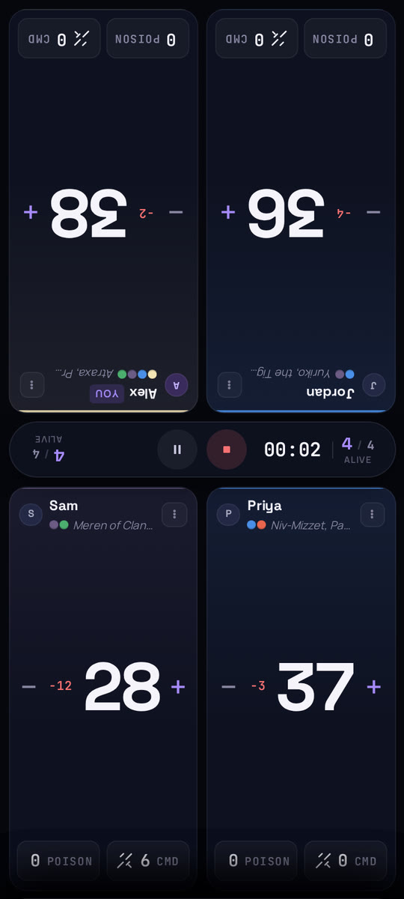
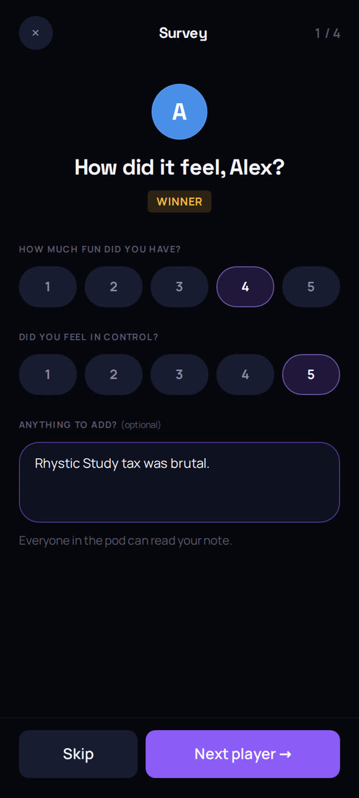
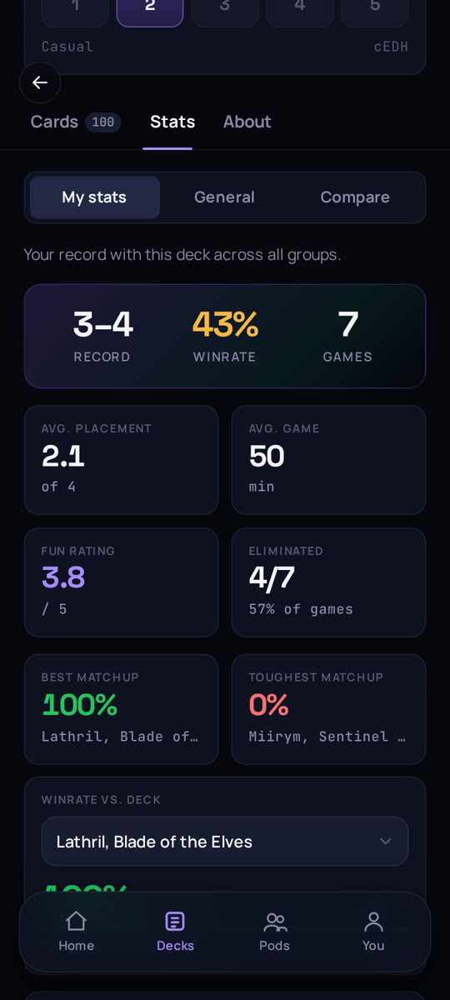
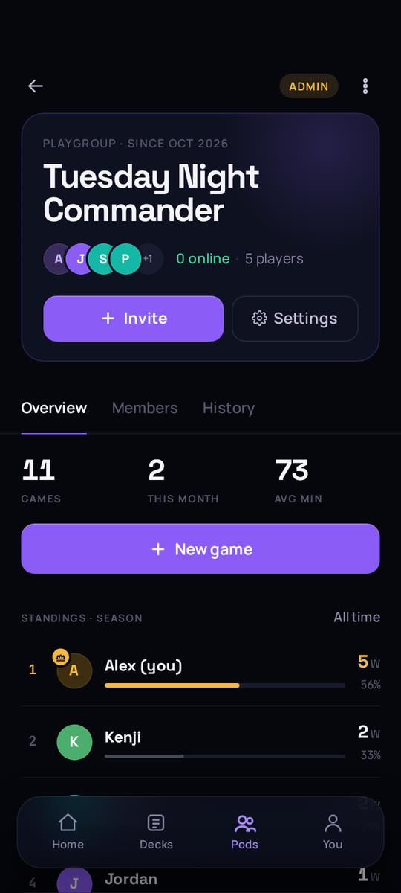

# Svey

**The scoreboard your Commander pod actually uses.**

**[Open the app at svey.app](https://svey.app)** · [Features](#what-you-get) · [Screenshots](#screenshots) · [Contributing](#contributing)

Svey is game tracking, deck management and stats for Magic: The Gathering Commander playgroups that play often enough to wonder who is really winning. One phone in the middle of the table runs the game: life, poison and commander damage are tracked live, and eliminations are detected automatically. When the game ends, the phone goes around and everyone rates how it felt. Every game feeds standings and deck stats that the whole pod can see, so the argument about whose deck is secretly busted finally has data.

## What you get

- **One phone runs the game.** Life, poison and per-opponent commander damage on a single shared screen. Tiles for the far side of the table are rotated 180° so everyone can read their own. Players are out automatically at 0 life, 10 poison or 21 damage from one commander, or by hand for card effects and concessions.
- **Quick setup.** Seat pod members or one-off guests and hand each a deck. Decks can be borrowed: a borrowed deck counts toward the pilot's record, not the owner's.
- **A two-tap survey.** After the game, each player rates fun and how in control they felt, and can leave an optional note for the pod. Skipping is fine.
- **Decks from [Archidekt](https://archidekt.com).** Import a deck, re-sync it when you tweak the list, and get an estimated power bracket (1–5) from its contents that you can override. Card art comes from Scryfall, with the illustrator credited.
- **Deck stats.** Record, winrate, average placement, game length, fun rating, and best and toughest matchups for every deck. Switch between your own results, everyone who runs the same commander, and a side-by-side comparison.
- **Pod stats.** Playgroups ("pods") are joined with an invite code and have admin and member roles. Each pod gets standings, a "threat" rating, win share, streaks and its full game history.
- **Also:** sign in with Discord, Google, or email and password (with verification and reset); delete your account yourself at any time; install it as a PWA; use it in English or German.

## Screenshots

<table>
<tr>
<td align="center"> Live tracker</td>
<td align="center"> Post-game survey</td>
</tr>
<tr>
<td align="center"> Deck stats</td>
<td align="center"> Pod overview</td>
</tr>
</table>

The screens show seeded demo data, not real players.

## Contributing

Svey is a side project in active use, and the code is open. Changes go through pull requests on GitHub flow. Local setup, scripts, architecture, testing, deployment and the list of [known gaps](CONTRIBUTING.md#known-gaps) are in [CONTRIBUTING.md](CONTRIBUTING.md).

Built with Vue 3, Fastify, PostgreSQL and TypeScript.

## About

Built by Moritz Wirth. It started as a tool for my own Commander group.

I developed it with [Claude Code](https://claude.com/claude-code) as an AI pair programmer. The project conventions it works from are in [`.claude/CLAUDE.md`](.claude/CLAUDE.md).

## License

[MIT](LICENSE)

Svey is unofficial Fan Content permitted under the [Fan Content Policy](https://company.wizards.com/en/legal/fancontentpolicy). It is not approved or endorsed by Wizards. Portions of the materials used are property of Wizards of the Coast. ©Wizards of the Coast LLC. Card data comes from Archidekt and Scryfall, and card art is shown via Scryfall.
