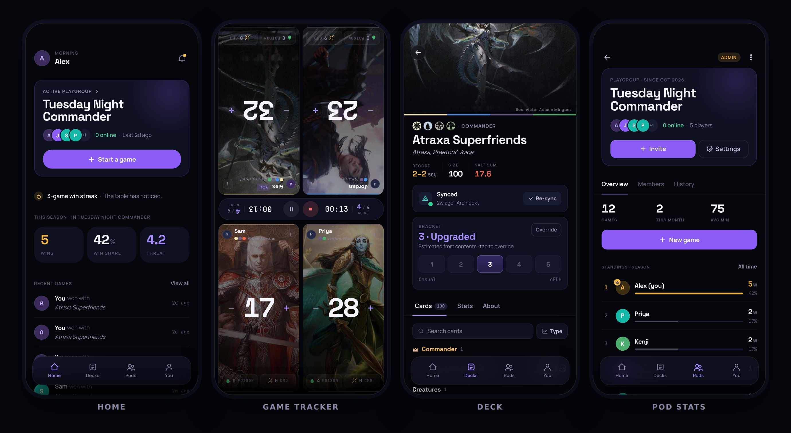
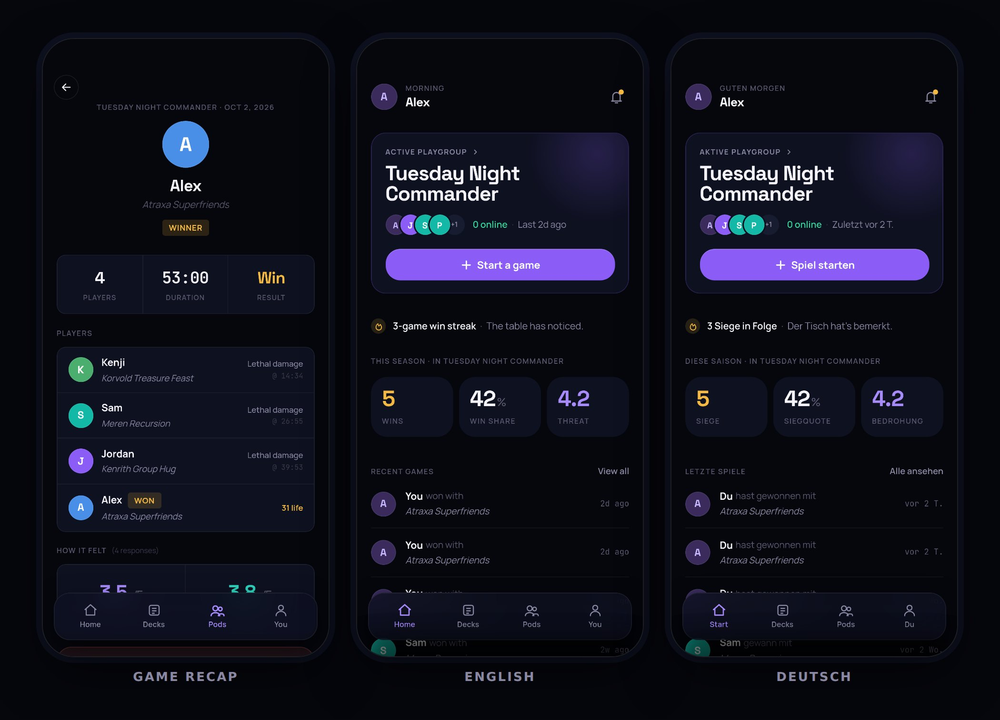
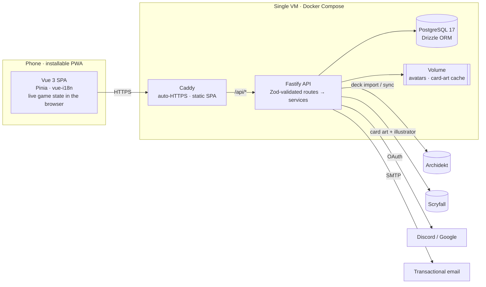

<div align="center">


# Svey

**Game tracking, deck management and stats for Magic: The Gathering Commander playgroups.**

One phone in the middle of the table runs the game. Life, poison and commander damage are tracked live, eliminations are detected automatically, and every player rates the game afterwards. Each game feeds standings and deck stats that the whole pod can see.

[](https://github.com/Holytrashbag/svey/actions/workflows/ci.yml)
[](https://github.com/Holytrashbag/svey/releases)
[](LICENSE)


**[svey.app](https://svey.app)** · [Run it locally](#run-it-locally) · [Architecture](#architecture) · [Engineering highlights](#engineering-highlights)



</div>

## What it does

- **Live game tracker.** It's built for a single shared phone: tiles for the far side of the table are rotated 180°. It tracks life, poison and per-opponent commander damage. Players are eliminated automatically at ≤ 0 life, 10 poison or 21 damage from one commander, or manually for card effects and concessions.
- **Game setup.** You seat pod members or one-off guests and hand each a deck. Decks can be borrowed: a borrowed deck counts toward the pilot's record, not the owner's.
- **Post-game survey.** The phone goes around the table. Each player rates fun and sense of control, and can leave a note. Players can skip.
- **Decks.** Decks are imported from [Archidekt](https://archidekt.com) and can be re-synced on demand. Each deck gets an estimated power bracket (1–5) from its contents, which the owner can override. Card art comes from Scryfall, with illustrator credit.
- **Playgroups ("pods").** You join with an invite code. Pods have admin/member roles, standings, a "threat" rating, win share, streaks and game history.
- **Accounts.** Sign in with Discord, Google, or email and password with verification and reset. Includes self-service account deletion.
- **Installable PWA, in English and German.**

<details>
<summary>More screens: game recap, English and German</summary>
<br/>

</details>

## Run it locally

You need **Node ≥ 22.12**, **pnpm** and **Docker** (for Postgres). No OAuth keys or Archidekt account are required: the seed creates a demo pod you can sign into with email and password.

```sh
corepack enable                 # installs the pnpm version pinned in package.json
pnpm install

cp apps/api/.env.example apps/api/.env
cp apps/frontend/.env.example apps/frontend/.env

pnpm dev                        # Postgres in Docker, migrations, demo seed, then API on :3000 + app on http://localhost:5173
```

Sign in with **`demo@example.com`** / **`svey-demo`**.

Notes:
- New email sign-ups work too. Without SMTP settings, the verification link is printed to the API console.
- Discord and Google login need a client ID and secret in `apps/api/.env`.

<details>
<summary>All scripts</summary>

| Command | What it does |
|---|---|
| `pnpm dev` | Start Postgres, apply migrations, seed demo data (first run only), then run API (watch mode) and frontend (Vite) together |
| `pnpm build` | Type-check and build both apps |
| `pnpm test` | API tests (`node:test`) and frontend tests (Vitest) |
| `pnpm lint:check` / `pnpm lint` | oxlint + ESLint (`lint` auto-fixes) |
| `pnpm check-types` | `tsc` for the API, `vue-tsc` for the frontend |
| `pnpm db:up` / `db:down` / `db:reset` | Start, stop, or wipe the local Postgres container |
| `pnpm db:migrate` | Apply pending migrations from `apps/api/db/migrations/` |
| `pnpm --filter api seed` | Insert the demo data (no-op if it already exists) |
| `pnpm --filter api db:studio` | Browse the database in Drizzle Studio |

</details>

## Architecture



- **Monorepo** (Turborepo + pnpm) with two apps: [`apps/frontend`](apps/frontend) and [`apps/api`](apps/api).
- **The SPA and API share one origin.** Every endpoint lives under `/api`, so Caddy serves the SPA and proxies the API with no CORS in production.
- **The game runs in the browser.** Setup is stored in `localStorage`, the tracker works without a connection, and the finished game is sent to the API in a single request once the survey is done.
- **The API is layered.** Route files declare Zod schemas and stay thin. Business logic lives in `services/*` as plain functions that receive a `Db` handle, and data access goes through Drizzle.

## Engineering highlights

| Area | What's worth a look |
|---|---|
| **Game rules as pure functions** | Elimination rules, clock and seat layout in [`lib/game-tracker.ts`](apps/frontend/src/lib/game-tracker.ts), unit-tested in [`game-tracker.test.ts`](apps/frontend/src/lib/game-tracker.test.ts). Example: 15 + 15 damage from two different commanders doesn't kill; 21 from one does. |
| **Authorization in the service layer** | Playgroup and game access is checked in the service functions, not the route handlers (see `assertPlaygroupMember` in [`game.service.ts`](apps/api/services/game.service.ts)). Errors are normalized to `{ error: { code, message } }` by [`plugins/error-handler.ts`](apps/api/plugins/error-handler.ts). That handler is tested to never leak internal error messages and to pass framework 4xx errors through ([tests](apps/api/test/plugins/error-handler.test.ts)). |
| **Privacy by design (GDPR)** | OAuth tokens are encrypted at rest with AES-256-GCM, using a key derived from the auth secret via HKDF ([`lib/token-crypto.ts`](apps/api/lib/token-crypto.ts) + [tests](apps/api/lib/token-crypto.test.ts)). Account deletion erases or anonymizes app data before the auth record goes ([`services/account.service.ts`](apps/api/services/account.service.ts)). The accepted terms version is recorded at sign-up. A nightly job removes orphaned data ([`plugins/scheduled-jobs.ts`](apps/api/plugins/scheduled-jobs.ts)). The operator's legal contact details are injected at build time and are not in the repo ([`lib/legal-contact.ts`](apps/frontend/src/lib/legal-contact.ts)). |
| **Third-party APIs, defensively** | Archidekt decks are parsed and validated with Zod ([`lib/archidekt.ts`](apps/api/lib/archidekt.ts)). A deck deleted upstream is flagged, never silently removed. Scryfall art is proxied and cached on disk, so browsers never contact Scryfall directly, and the illustrator is credited wherever art is shown ([`lib/scryfall.ts`](apps/api/lib/scryfall.ts)). |
| **Typed i18n** | The English message files define the schema. A test fails if German misses a key, drops an interpolation parameter or has an empty string ([`i18n/messages.test.ts`](apps/frontend/src/i18n/messages.test.ts)). Notifications store their parameters as well as text, so the client can localize them. |
| **Production ops on a budget** | Multi-stage Docker images are pushed to GHCR. Every deploy is gated on the full CI suite ([`deploy.yml`](.github/workflows/deploy.yml) reuses [`ci.yml`](.github/workflows/ci.yml)). Migrations run on container start. Hosts are hardened with cloud-init ([`scripts/cloud-init.yaml`](scripts/cloud-init.yaml)). Backups run nightly, are encrypted with `age`, and are mirrored off-site, with a [restore runbook](docs/ops/backup-restore.md). |
| **Reproducible demo data** | A deterministic seed builds a realistic pod by going through the same services the app uses ([`jobs/seed-demo.ts`](apps/api/jobs/seed-demo.ts)). |

## Tech stack

| Layer | Choice | Why |
|---|---|---|
| Frontend | Vue 3 (`<script setup>`), Vite, Pinia, Vue Router | Small runtime and fast HMR. Composition API keeps logic in testable functions. |
| Styling | Tailwind CSS v4 | Design tokens live in CSS. The app is dark-mode only. |
| i18n | vue-i18n with a typed message schema | EN and DE, with locale-aware dates and numbers |
| API | Fastify 5 + `fastify-type-provider-zod` | Request schemas double as runtime validation and TypeScript types |
| Database | PostgreSQL 17 + Drizzle ORM | SQL-first, typed queries. Migrations are plain SQL files. |
| Auth | Better Auth | Sessions, OAuth (Discord, Google), email verification and password reset without a SaaS dependency |
| Testing | Vitest, `node:test` | Native and fast. The API tests run on Node's built-in TypeScript stripping. |
| Tooling | Turborepo, pnpm, oxlint, ESLint, GitHub Actions | |
| Hosting | Docker Compose on one VM, Caddy, GHCR | Cheap and simple to operate, with automatic TLS |

## Project structure

```
apps/
├── api/                    Fastify API (TypeScript, no build step in dev)
│   ├── app.ts              autoloads plugins/ and routes/ (under /api)
│   ├── routes/             thin handlers + Zod schemas, one folder per domain
│   ├── services/           business logic: games, decks, playgroups, stats, accounts
│   ├── lib/                auth, db, env validation, Archidekt/Scryfall clients, crypto
│   ├── plugins/            cors, error handler, uploads, scheduled jobs
│   ├── db/                 Drizzle schema + SQL migrations + migration runner
│   ├── jobs/               one-off scripts (demo seed, cleanup, token backfill)
│   └── test/               route/plugin tests (unit tests sit next to their source)
└── frontend/               Vue 3 SPA
    └── src/
        ├── views/          route-level pages
        ├── components/     ui/ primitives (Sb*), game-setup/ (Gs*), game-tracker/ (Gt*), …
        ├── stores/         Pinia stores; all HTTP goes through lib/api.ts
        ├── lib/            pure logic (game rules, time bucketing, colours)
        └── i18n/           locale files (en, de) + formats
docs/ops/                   backup and restore runbook
scripts/                    cloud-init, backup/restore scripts
```

## Testing

```sh
pnpm test
```

- **Frontend:** game rules, relative-time bucketing, and locale completeness.
- **API:** token encryption, bracket estimation, error handling, and HTTP smoke tests that boot the full app.

Neither suite needs a database. The API tests read a committed, non-secret [`apps/api/.env.test`](apps/api/.env.test). CI runs lint, type-checks, tests and a production build on every push and pull request.

## Development workflow

The repo uses **GitHub flow**. Every change is a short-lived branch and a pull request, and `main` is protected. A PR merges only when CI passes and its title is a [Conventional Commit](https://www.conventionalcommits.org/); it is then squash-merged.

Each merge to `main` deploys. [release-please](https://github.com/googleapis/release-please) turns the merged titles into [`CHANGELOG.md`](CHANGELOG.md) and versioned [releases](https://github.com/Holytrashbag/svey/releases).

Details are in [CONTRIBUTING.md](CONTRIBUTING.md).

## Deployment

Production is one VM running [`docker-compose.prod.yml`](docker-compose.prod.yml): Postgres, the API image and a Caddy image that serves the built SPA. On every push to `main`, [`deploy.yml`](.github/workflows/deploy.yml) runs CI, builds both images, pushes them to GHCR, and restarts the stack over SSH.

<details>
<summary>Repository secrets and variables the deploy workflow expects</summary>

| Name | Kind | Purpose |
|---|---|---|
| `SSH_HOST`, `SSH_USER`, `SSH_KEY`, `SSH_PORT` | secret | SSH target for the deploy step |
| `VITE_LEGAL_NAME`, `VITE_LEGAL_STREET`, `VITE_LEGAL_CITY`, `VITE_LEGAL_EMAIL`, `VITE_LEGAL_PHONE` | secret | Impressum and privacy-page contact details baked into the SPA. The deploy fails if any are missing. |
| `SITE_URL` | variable | public origin, e.g. `https://svey.app` |

The host pulls the private images with the deploy job's own short-lived `GITHUB_TOKEN`, so there is no registry token to rotate. Server-side configuration lives in `/opt/svey/.env.prod` on the host (see [`.env.prod.example`](.env.prod.example)).

</details>

## Known gaps

This is a side project in active use, not a finished product. Things I'd tackle next:

- **Mid-game recovery.** Only the table setup is kept in `localStorage`, so reloading the tracker restarts life totals. The next step is to persist tracker state after each change and offer a resume.
- **Commander-damage history.** It's tracked live but not stored with the game. The schema already has `commander_damage` and decklist-snapshot tables.
- **Scheduled Archidekt re-sync.** Re-sync is manual today.
- **Localized server errors.** API error messages are English. The client could map error codes instead.
- **Service-level integration tests** against a real Postgres in CI, covering stats aggregation in particular.

## About

Built by Moritz Wirth. It started as a tool for my own Commander group.

I developed it with [Claude Code](https://claude.com/claude-code) as an AI pair programmer. The project conventions it works from are in [`.claude/CLAUDE.md`](.claude/CLAUDE.md).

## License

[MIT](LICENSE)

Svey is unofficial Fan Content permitted under the [Fan Content Policy](https://company.wizards.com/en/legal/fancontentpolicy). It is not approved or endorsed by Wizards. Portions of the materials used are property of Wizards of the Coast. ©Wizards of the Coast LLC. Card data comes from Archidekt and Scryfall, and card art is shown via Scryfall.
