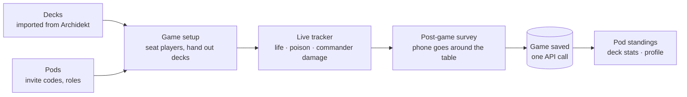

# Module 1: Welcome to Svey

**Duration:** 35 min · **Level:** Beginner · **Prerequisites:** none

Svey is a companion app for Magic: The Gathering **Commander** playgroups. Before you read any code you need two things: a picture of what the app does at the table, and the vocabulary the code uses. Both are in this module.

## Learning objectives

After this module you can:

- Describe the four product areas (live tracker, survey, decks, pods) and how they feed each other.
- Explain the Commander rules the tracker enforces: 40 life, 10 poison, 21 commander damage from a single commander.
- Use the domain terms correctly: pod, member, admin, owner, pending, guest, host, borrowed deck, concede, retire, cancel.
- Name the product principles that constrain technical choices.

---

## Unit 1: What Svey does

Picture four friends around a table, one phone lying in the middle.



| Area | What the user sees | Where it lives |
|---|---|---|
| **Live game tracker** | Tiles per player, far side rotated 180°, automatic eliminations | [`GameTrackerView.vue`](../../apps/frontend/src/views/GameTrackerView.vue), [`lib/game-tracker.ts`](../../apps/frontend/src/lib/game-tracker.ts) |
| **Post-game survey** | Each player rates fun and agency (1–5) and may add a note; skippable | [`GameSurveyView.vue`](../../apps/frontend/src/views/GameSurveyView.vue) |
| **Decks** | Import from Archidekt, re-sync on demand, estimated power bracket, card art | [`services/deck.service.ts`](../../apps/api/services/deck.service.ts) |
| **Pods (playgroups)** | Join with an invite code; standings, threat, streaks, history | [`services/playgroup.service.ts`](../../apps/api/services/playgroup.service.ts) |
| **Accounts** | Discord, Google, or email + password; self-service deletion | [`lib/auth.ts`](../../apps/api/lib/auth.ts) |

It is an installable PWA in English and German, live at [svey.app](https://svey.app).

---

## Unit 2: A Commander crash course for developers

You don't need to play Magic to work on Svey, but you need the rules the tracker implements.

| Concept | Meaning | How the code models it |
|---|---|---|
| **Commander** | A multiplayer format, usually 3–5 players, each with a 100-card deck led by one legendary "commander" card | `decklist_card.is_commander` |
| **Starting life** | Each player starts at **40** life | `startLife: 40` in [`GameSetupView.vue`](../../apps/frontend/src/views/GameSetupView.vue) |
| **Loss by life** | At **0 or less** life you are out | `autoDeath` → `'life'` |
| **Poison** | **10** poison counters knock you out | `autoDeath` → `'poison'` |
| **Commander damage** | **21** combat damage from **one** commander knocks you out. Damage from different commanders does **not** add up | `cmdrDmg: Record<attackerSeatIdx, number>`; `autoDeath` checks the **max**, not the sum |
| **Concede** | A player gives up | death cause `concede` → API `conceded` |
| **Card effects** | "You lose the game" effects, rules oddities | manual elimination → API `special` |
| **Color identity** | The colors a deck may use: **W**hite, bl**U**e, **B**lack, **R**ed, **G**reen (plus colorless) | `deck.color_identity text[]`, always ordered `W U B R G` |
| **Bracket** | Commander's 1–5 power-level scale used to match decks of similar strength | `deck.bracket_estimated`, `deck.bracket_override` |
| **Salt score** | A crowd-sourced (EDHREC) rating of how frustrating a card is to play against | `decklist_card.salt_score`, feeds the bracket estimate |

The core rule is so central it has its own tests ([`game-tracker.test.ts`](../../apps/frontend/src/lib/game-tracker.test.ts)):

```ts
it('does not add commander damage across different commanders', () => {
  // 15 + 15 = 30 total, but no single commander reached 21.
  expect(autoDeath(player({ cmdrDmg: { 1: 15, 2: 15 } }))).toBeNull()
})
```

**External services you'll hear about:**

- **Archidekt** is a deck-building website. Users paste a deck URL and Svey imports the list.
- **Scryfall** is the canonical card database and image host. Svey fetches card art and the illustrator's name from it.
- **Oracle ID** is Scryfall's identifier for a card *as a game object*, independent of printing. Svey stores it in a column confusingly named `scryfall_id`. More in [Module 9](09-integrations-archidekt-scryfall.md).

---

## Unit 3: The domain vocabulary

These words appear in code, UI copy and issues. Use them precisely.

### People and groups

| Term | Definition | In the code |
|---|---|---|
| **Playgroup / Pod** | A group of people who play together. "Pod" is the UI word; the code and database say `playgroup`. Frontend routes use `/pods` | `playgroup` table, `/pods/:id` |
| **Member** | A person's membership in one pod. One user can be a member of several pods, with a separate membership row each | `playgroup_member` |
| **Admin** | A member role that can approve, remove and promote members and regenerate the invite code | `playgroup_member.role = 'admin'` |
| **Owner** | The user recorded as the pod's creator. Admins cannot demote the owner; only the owner can transfer ownership | `playgroup.created_by` (a user id, not a member id) |
| **Pending member** | A membership that is not active yet. Pending members are excluded from stats and access checks | `playgroup_member.is_pending = true` |
| **Invite code** | A code like `SPELL-K7QX-42` used to join a pod | `playgroup.invite_code` |
| **Guest** | A one-off player without an account. A guest has a seat in a game but no membership | `game_player.guest_name`, `playgroup_member_id = null` |

### Games

| Term | Definition | In the code |
|---|---|---|
| **Seat** | One position at the table, holding a member or guest and a deck | `GsSeat`, `game_player.turn_order` |
| **Host** | The signed-in user whose phone logged the game | `game.host_user_id` |
| **Borrowed deck** | A deck played by someone other than its owner. It counts toward the **pilot's** record, not the owner's | `game_player.deck_id` + `playgroup_member_id` |
| **End game** | Normal finish: one player left standing | `endReason: 'won'` |
| **Retire** | Stop early and still log the game, with reasons, and no winner | `endReason: 'abandoned'` + `abandonReasons` |
| **Cancel** | Throw the game away. Nothing is saved | No API call |
| **Survey** | Per-player fun rating, agency rating ("sense of control") and takeaway | `survey_response` |
| **Recap** | The read-only summary page of a saved game | `/games/:id`, [`GameRecapView.vue`](../../apps/frontend/src/views/GameRecapView.vue) |

### Stats

| Term | Definition |
|---|---|
| **Win rate** | Wins divided by **finished games the member played**, as an integer percentage. `null` (shown as "—") until the member has played |
| **Threat** | The same ratio on a 0–10 scale with one decimal (3 wins in 4 games → 7.5) |
| **Streak** | Consecutive most-recent pod games won by you |
| **Finished game** | A game with `endReason` `won` or `draw`. Retired games don't count toward pod standings |

[Module 10](10-stats-and-aggregations.md) covers the exact rules.

---

## Unit 4: Product principles that shape the code

These are product decisions. Many technical choices in later modules follow from them.

1. **One phone, no sync.** The tracker runs entirely in the browser on one device. There is no websocket, no multi-device state, and no server round-trip during a game. The finished game is sent in **one** request.
2. **Never interrupt a live game.** The PWA updates only when the user taps "Reload" (`registerType: 'prompt'`), so a deploy can't reload the page mid-game.
3. **Privacy by design (GDPR).** The operator is in Germany. That is why OAuth tokens are encrypted at rest, IPs are stripped from production logs, fonts are self-hosted, card art is proxied, and account deletion anonymises shared history instead of breaking it.
4. **Stats are social.** Pod stats are visible to every member of the pod. Cross-pod deck stats are private to the deck owner.
5. **Look and voice.** A modern sports-stats app (jewel tones on near-black, rounded corners), **not** fantasy kitsch. Copy is playful but functional, with no fantasy clichés.
6. **Mobile first.** Every layout must fit a 360 px-wide phone. Dark mode is the only mode.

---

## Summary

- Svey turns a Commander game night into data: setup → live tracker → survey → one saved game → stats.
- The tracker enforces 40 life, 10 poison and 21 damage from a *single* commander.
- "Pod" in the UI is `playgroup` in code; owner (`created_by`) and admin (`role`) are different things; guests have no membership row.
- Retire saves the game without a winner; cancel saves nothing.

## Knowledge check

**1. A player has taken 12 commander damage from Alex's commander and 11 from Sam's. Their life is 17. What does the tracker do?**

- A) Eliminates them for commander damage, because 23 ≥ 21
- B) Nothing; they are still alive
- C) Eliminates them for life loss
- D) Asks the table to confirm an elimination

<details><summary>Answer</summary>

**B.** Commander damage is checked per attacking commander (`Math.max` over `cmdrDmg`), never summed. Neither commander reached 21, and life is above 0.
</details>

**2. Which statement about the pod "owner" is correct?**

- A) Every admin is an owner
- B) The owner is stored as `playgroup_member.role = 'owner'`
- C) The owner is the user in `playgroup.created_by`; admins can't change the owner's role
- D) A pod can have several owners

<details><summary>Answer</summary>

**C.** There is no `owner` role. The owner is `playgroup.created_by`, and `updateMemberRole` refuses to change that user's role. Ownership moves only through `transferOwnership`.
</details>

**3. Halfway through a game the table decides to stop and play something else, but wants the game in their history. Which action fits?**

- A) Cancel
- B) Retire
- C) Concede for every player but one
- D) End game

<details><summary>Answer</summary>

**B.** Retire saves the game with `endReason: 'abandoned'` and the chosen reasons, with no winner. Cancel saves nothing. Conceding everyone would fabricate a winner.
</details>

**4. Maya plays Jordan's deck in a pod game and wins. Whose record gets the win?**

- A) Jordan's, as the deck owner
- B) Maya's, as the pilot
- C) Both
- D) Neither; borrowed decks are excluded

<details><summary>Answer</summary>

**B.** Records follow the pilot (`game_player.playgroup_member_id`). The deck is linked through `deck_id`, so the deck's own stats include the game too.
</details>

**5. Why doesn't the tracker send each life change to the API?**

- A) The API has no endpoint for it yet
- B) The product is a single-device flow; the game lives in the browser and is saved once at the end
- C) Rate limits on the API
- D) WebSockets are blocked by Caddy

<details><summary>Answer</summary>

**B.** The single-phone design means no sync is needed. The game state lives client-side and is sent in one `POST /api/games` after the survey.
</details>

---

**Next:** [Module 2: Architecture and technical decisions →](02-architecture-and-decisions.md)
