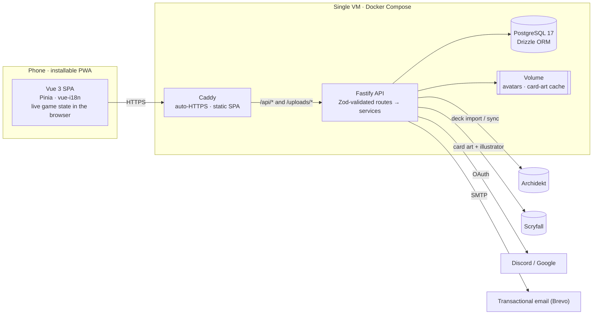
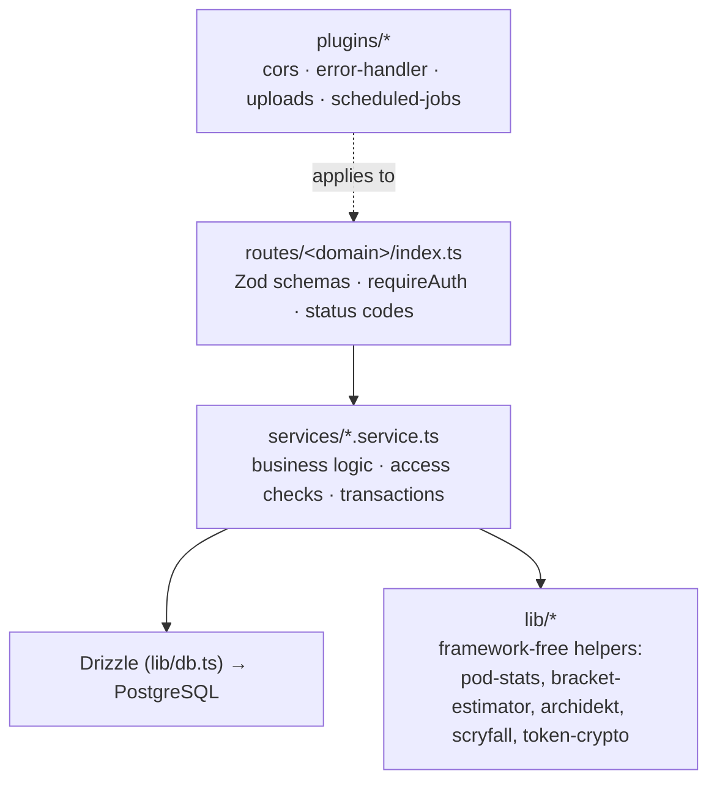
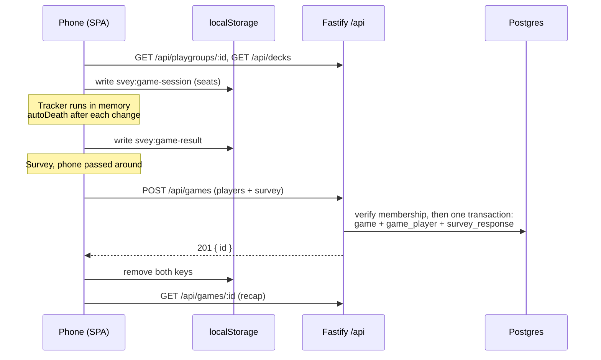

# Module 2: Architecture and technical decisions

**Duration:** 45 min · **Level:** Beginner–Intermediate · **Prerequisites:** [Module 1](01-welcome-to-svey.md)

This module gives you the map before the territory: how the pieces fit together, and *why* each technology was chosen. When you later want to change one of these choices, this page tells you what it was protecting.

## Learning objectives

After this module you can:

- Draw the runtime architecture from memory: phone → Caddy → API → Postgres, plus the four external services.
- Explain the single-origin `/api` design and what it saves.
- Justify each major technology choice and name its main trade-off.
- Describe the backend layering (routes → services → database, with `lib/` for framework-free helpers).
- List the known gaps of the current system.

---

## Unit 1: The system at a glance



Three containers run in production: `caddy` (serves the built SPA and reverse-proxies), `api` (Fastify on port 3000, not published) and `db` (Postgres 17, not published). Two directories on an attached volume hold the database files and user uploads.

### The repository

```
svey/
├── apps/
│   ├── api/            Fastify + TypeScript, files at the package root (no src/)
│   └── frontend/       Vue 3 + Vite SPA (PWA)
├── docs/               onboarding (this), ops runbook, screenshots
├── scripts/            cloud-init, backup/restore
├── .github/            CI, deploy, PR-title check, release-please, Dependabot
├── .claude/            CLAUDE.md conventions + skills (workflow playbooks)
├── docker-compose.yml        local Postgres only
├── docker-compose.prod.yml   production stack
├── Caddyfile                 production edge config
└── turbo.json, pnpm-workspace.yaml
```

There are **no shared packages**. The two apps share nothing at build time, which keeps the build trivial but means API types are re-declared on the frontend in [`src/types/api.ts`](../../apps/frontend/src/types/api.ts). See Unit 3.

---

## Unit 2: One origin, everything under `/api`

Every API endpoint is registered under `/api` ([`app.ts`](../../apps/api/app.ts)):

```ts
// All API routes live under a single `/api` prefix so the backend can be
// deployed on one origin alongside the SPA without path collisions
// (e.g. the SPA's `/decks` route vs the decks API endpoint).
void fastify.register(
  async (api) => {
    void api.register(AutoLoad, { dir: path.join(__dirname, 'routes'), options: opts, forceESM: true })
  },
  { prefix: '/api' },
)
```

Caddy then routes by path ([`Caddyfile`](../../Caddyfile)):

```caddy
handle /api/*     { reverse_proxy api:3000 }
handle /uploads/* { reverse_proxy api:3000 }
handle {
    root * /srv
    try_files {path} /index.html
    file_server
}
```

**What this buys:**

- **No CORS in production.** The SPA and API share `https://svey.app`. CORS is configured ([`plugins/cors.ts`](../../apps/api/plugins/cors.ts)) only because in development the SPA runs on `:5173` and the API on `:3000`.
- **First-party cookies.** Better Auth's session cookie is same-site, so there are no third-party cookie problems on iOS.
- **No route collisions.** `/decks` is the SPA page; `/api/decks` is the endpoint.

---

## Unit 3: Technology decisions

Each row is effectively a lightweight architecture decision record. "Trade-off" is the price paid, which is usually what you'll run into.

| Area | Decision | Why | Trade-off |
|---|---|---|---|
| Repo | **Turborepo + pnpm** monorepo, two apps, no shared packages | One clone, one lockfile, one CI run; Turbo caches `build` | Types are duplicated: a service return type change must be mirrored in `frontend/src/types/api.ts` by hand |
| Runtime | **Node 26** (`.nvmrc`), ESM everywhere | Native TypeScript stripping lets the API run `.ts` directly in tests and scripts | API code must use *erasable* syntax only (`erasableSyntaxOnly`): no TS `enum`, `namespace` or parameter properties. That's why enums are `const` objects |
| Frontend | **Vue 3** `<script setup>`, **Vite**, **Pinia**, **Vue Router** | Small runtime, fast HMR, Composition API keeps logic in plain testable functions | No SSR (not needed: everything is behind login) |
| Styling | **Tailwind CSS v4** with `@theme` tokens in CSS | Design tokens live in one CSS file; no config file | Long class strings; discipline needed to use tokens instead of raw hex |
| i18n | **vue-i18n** with `en` as the typed schema | Typed keys; a test guarantees `de` matches `en` | Every UI string needs two JSON entries |
| API | **Fastify 5** + **fastify-type-provider-zod** | Fast, plugin-based; one Zod schema gives runtime validation *and* TS types | Zod schemas are inline per route file, so they can drift from the frontend types |
| Database | **PostgreSQL 17** + **Drizzle ORM** | SQL-first, typed query builder, no heavy runtime | Drizzle doesn't own the schema: SQL migrations do (Module 7) |
| Migrations | **Plain SQL files** + a 50-line runner | Exactly what runs in production is reviewable SQL; runs on container start | Forward-only. You draft SQL with drizzle-kit, then hand-curate it |
| Auth | **Better Auth** (self-hosted library) | Sessions, OAuth, email verification, password reset, account deletion without a SaaS vendor or per-user cost | Its tables are mapped by hand to snake_case and live outside `schema.ts` |
| Game state | **Client-side only**, saved in one request | Works offline at the table, no sync complexity | A page reload during a game restarts life totals (known gap) |
| Testing | **node:test** (API), **Vitest** (frontend), **no database** in tests | Fast, zero infrastructure in CI | SQL aggregations aren't integration-tested; pure rules are extracted into `lib/` to compensate |
| Hosting | **Docker Compose on one VM**, **Caddy**, images on **GHCR** | Cheap, simple, automatic TLS | Single instance: the in-process cron job and card-art cache assume one API process |
| Delivery | **GitHub flow**, squash merges, **every merge deploys**, **release-please** for versions | Small PRs ship fast; the changelog writes itself from PR titles | Migrations go live with the merge, so they must be backward compatible |

### A closer look at three decisions

**Why plain SQL migrations instead of `drizzle-kit push`?** `push` diffs your TypeScript against a live database and applies changes directly. That is convenient locally and dangerous in production, because nothing reviewable records what happened. Svey treats `db/migrations/*.sql` as the single source of truth for the database, and `schema.ts` as a typed *view* of it. The `add-migration` skill uses drizzle-kit only to *draft* SQL.

**Why is game state client-side?** At a game table, connectivity is unreliable and latency is annoying. The domain is also single-writer (one phone). Keeping the tracker as pure in-memory state with pure rule functions (`autoDeath`, `gridForCount`) makes it fast, offline-capable and easy to unit-test. The cost is durability, and persisting tracker state to `localStorage` after each change is the top known gap.

**Why does the API run TypeScript without a build in dev?** The API's `dev` script runs `node --import tsx --watch server.ts`; tests and scripts use `node --experimental-strip-types`. Only the Docker image compiles to `dist/` (`tsc -p tsconfig.build.json`). Imports therefore use explicit `.ts` extensions (`import { db } from '../lib/db.ts'`), and `rewriteRelativeImportExtensions` turns them into `.js` in the compiled output.

---

## Unit 4: Backend layering



| Layer | Owns | Must not |
|---|---|---|
| **Routes** | Request/response shape (Zod), `requireAuth`, HTTP status codes | Contain business rules or access checks |
| **Services** | Rules, authorization, transactions, notifications | Know about Fastify (`request`, `reply`) |
| **lib/** | Pure rules and third-party clients | Import from `services/` or `routes/` (exception: `lib/auth.ts` calls `deleteAccountData`) |
| **plugins/** | Cross-cutting behaviour for the whole app | Contain domain logic |

On the frontend the mirror image is **views → stores → `lib/api.ts`**, with framework-free logic in `src/lib/` (Module 11).

---

## Unit 5: A game, end to end

This sequence ties the layers together. You'll study each step in detail later.



---

## Unit 6: Known gaps

From [CONTRIBUTING.md](../../CONTRIBUTING.md#known-gaps) and the code as of this writing. Good first issues often come from this list.

| Gap | Where it shows |
|---|---|
| Tracker state lives in memory; a reload restarts life totals | `GameTrackerView.vue` builds players from the session each mount |
| Commander damage isn't saved with the game | `commander_damage` and `game_decklist_card` tables exist but nothing writes them |
| Archidekt re-sync is manual | `POST /api/decks/:id/sync` only |
| API error messages are English | `lib/api.ts` surfaces `error.message` directly |
| No integration tests against a real Postgres | Stats SQL is untested end to end |
| Stats rules differ between pod standings and deck/profile stats | See [Module 10](10-stats-and-aggregations.md#unit-5-sharp-edges) |

---

## Summary

- Phone → Caddy → Fastify → Postgres on one VM, with Archidekt, Scryfall, OAuth and SMTP outside.
- Everything is on one origin; the API lives under `/api`.
- The choices favour simplicity and low running cost: plain SQL migrations, a self-hosted auth library, Compose on one VM, no DB in tests.
- Backend layering is routes → services → DB, with pure helpers in `lib/`.

## Knowledge check

**1. Why does the API register all routes under `/api`?**

- A) Fastify requires a prefix for autoloaded routes
- B) So the SPA and API can share one origin without path collisions, which removes CORS in production
- C) To version the API
- D) Caddy can only proxy prefixed paths

<details><summary>Answer</summary>

**B.** One origin means same-site cookies and no CORS, and `/decks` (SPA) can't collide with `/api/decks` (endpoint).
</details>

**2. You want to add a TypeScript `enum DeathCause { ... }` in the API. What happens?**

- A) It works; enums are idiomatic
- B) Type-checking fails because `erasableSyntaxOnly` forbids non-erasable syntax, which Node's type stripping can't run
- C) It compiles but Drizzle can't read it
- D) The linter auto-converts it

<details><summary>Answer</summary>

**B.** The API runs TypeScript via type stripping, which can only *remove* types, not generate code. `enum` emits runtime code, so `erasableSyntaxOnly` rejects it. Use a `const` object plus a union type.
</details>

**3. What is the source of truth for the production database structure?**

- A) `apps/api/db/schema.ts`
- B) The `db/drizzle/` folder
- C) The numbered SQL files in `apps/api/db/migrations/`
- D) Better Auth's internal schema

<details><summary>Answer</summary>

**C.** Only the SQL migrations change the database. `schema.ts` is Drizzle's typed view and must be kept in agreement by hand. `db/drizzle/` is a gitignored drafting area.
</details>

**4. Which component should contain the rule "only admins can approve pending members"?**

- A) The route handler in `routes/playgroups/index.ts`
- B) A Fastify plugin
- C) The service function `approveMember` in `playgroup.service.ts`
- D) The Vue view, by hiding the button

<details><summary>Answer</summary>

**C.** Access checks live in services. Hiding a button is UX, not security.
</details>

**5. Which trade-off comes with having no shared package between the apps?**

- A) Slower CI
- B) API response types must be mirrored manually in `frontend/src/types/api.ts`
- C) The frontend can't use Zod
- D) Turborepo caching doesn't work

<details><summary>Answer</summary>

**B.** Service types and frontend types are separate declarations. Change one, update the other in the same PR.
</details>

---

**Next:** [Module 3: Local setup and the first hour →](03-local-setup.md)
