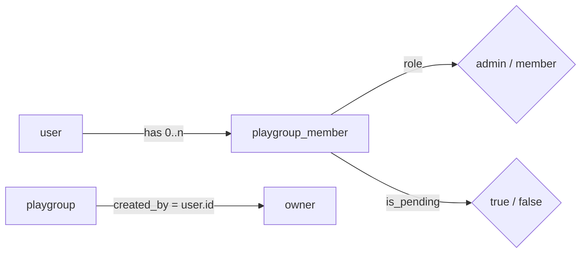

# Module 5: Services and authorization

**Duration:** 50 min · **Level:** Intermediate · **Prerequisites:** [Module 4](04-api-request-lifecycle.md)

Services are where Svey's rules live: who may do what, which writes happen together, and which side effects must never break the main action. This module teaches the service conventions and gives you the complete authorization matrix.

## Learning objectives

After this module you can:

- Write a service function with the house signature and error style.
- State who may perform each playgroup, game and deck action, and point to the check that enforces it.
- Distinguish an *owner* from an *admin* in code.
- Explain why IDs from a request body must be verified, and how `createGame` does it.
- Use transactions and best-effort side effects correctly.
- Recognise the query patterns used to avoid N+1 queries.

---

## Unit 1: The shape of a service

Services are **plain exported async functions** in [`apps/api/services/`](../../apps/api/services). No classes, no Fastify types:

```ts
export async function deleteGame(dbClient: Db, gameId: string, userId: string): Promise<void> {
  const gameRows = await dbClient
    .select({ playgroupId: game.playgroupId })
    .from(game)
    .where(eq(game.id, gameId))
    .limit(1)

  const gameRow = gameRows[0]
  if (!gameRow) throw Errors.notFound('Game not found')

  await assertPlaygroupMember(dbClient, gameRow.playgroupId, userId)

  await dbClient.delete(game).where(eq(game.id, gameId))
}
```

Conventions you see here and everywhere else:

| Convention | Why |
|---|---|
| First parameter is the database handle (`dbClient: Db`) | Callers can pass the real `db`, and scripts (the seed) reuse services unchanged |
| The acting user's id is a parameter | The service never reads a request; it receives a verified id from `requireAuth` |
| Look up, then **check**, then act | Not-found and access errors come before any write |
| `throw Errors.xxx(message)` for expected failures | The error handler turns it into the envelope (Module 4) |
| `rows[0]` then a guard | `.limit(1)` still returns an array; check it explicitly |
| Return plain serialisable objects, dates as ISO strings | The route sends them as JSON unchanged |
| Exported `type`s for inputs and outputs | Routes and the seed import them; the frontend mirrors them in `types/api.ts` |

---

## Unit 2: Owner, admin, member, pending

Authorization in Svey revolves around `playgroup_member` rows. Four flags matter:



- **Active member:** a row with `user_id = me` and `is_pending = false`.
- **Admin:** an active member with `role = 'admin'`. A pod can have several.
- **Owner:** the user id in `playgroup.created_by`. The creator starts as owner *and* admin. Ownership is a user-level fact on the pod, not a role.
- **Pending:** a row with `is_pending = true`. Pending rows are excluded from access checks, stats and member lists.

The basic gate is `assertPlaygroupMember` in [`game.service.ts`](../../apps/api/services/game.service.ts):

```ts
/** Throws 403 unless `userId` is an active member of the playgroup. */
async function assertPlaygroupMember(dbClient: Db, playgroupId: string, userId: string): Promise<void> {
  const memberRows = await dbClient
    .select({ id: playgroupMember.id })
    .from(playgroupMember)
    .where(and(
      eq(playgroupMember.playgroupId, playgroupId),
      eq(playgroupMember.userId, userId),
      eq(playgroupMember.isPending, false),
    ))
    .limit(1)
  if (!memberRows.length) throw Errors.forbidden('Not a member of this playgroup')
}
```

[`playgroup.service.ts`](../../apps/api/services/playgroup.service.ts) repeats a similar "caller row" lookup inline in each function and then checks `role`.

---

## Unit 3: The authorization matrix

Derived from the service code. "Active member" means non-pending.

### Playgroups

| Action | Service | Who may | Extra rules |
|---|---|---|---|
| List my pods | `listPlaygroups` | any user | Returns `active` and `pending` lists for the caller only |
| Create a pod | `createPlaygroup` | any user | Caller becomes `admin` and `created_by` (owner) in one transaction |
| Join by code | `joinPlaygroup` | any user | Code is trimmed and upper-cased; 404 if unknown, 409 if already a member. Joins as **active** `member`; admins get a `member_joined` notification |
| View pod detail | `getPlaygroupDetail` | active member | 404 if the pod doesn't exist, 403 if not a member |
| Accept an invite | `acceptInvite` | the invited user | 403 if the row's `user_id` isn't the caller; 400 if not pending |
| Remove a member / leave / decline | `removeMember` | admin, **or** self | Anyone can remove their own row; only admins remove others |
| List pending members | `listPendingMembers` | admin | |
| Approve a pending member | `approveMember` | admin | 400 if not pending; notifies the approved user |
| Change a role | `updateMemberRole` | admin | **Cannot change the owner's role** (403); notifies the target |
| Regenerate invite code | `regenerateInviteCode` | admin | Old code stops working immediately |
| Transfer ownership | `transferOwnership` | **owner only** | Target must be an active member with an account; becomes `admin`; `created_by` moves, in one transaction |

### Games

| Action | Service | Who may |
|---|---|---|
| Save a game | `createGame` | active member of `podId`; every seated **member** must belong to that pod |
| View a recap | `getGameDetail` | active member of the game's pod |
| Delete a game | `deleteGame` | active member of the game's pod (any member, not just the host) |

### Decks, stats and notifications

| Action | Who may |
|---|---|
| Read, sync, update a deck; read deck stats | the deck **owner** only (`deck.owner_user_id = userId`, else 403) |
| List decks | returns only the caller's decks (filtered by `owner_user_id`) |
| Player stats / deck stats for "me" | scoped to the caller's own membership ids |
| Read / mark notifications | scoped by `notification.user_id = userId` in the `WHERE` clause, so another user's id simply matches nothing |

> **Rule of thumb:** a 404 says "doesn't exist", a 403 says "exists, not yours". Services look the resource up first, then check access, which is why both appear.

---

## Unit 4: Never trust IDs from the body

The client sends member ids in `POST /api/games`. A malicious or buggy client could send members of *another* pod and pollute their stats. `createGame` checks before writing:

```ts
export async function createGame(dbClient: Db, userId: string, body: CreateGameBody): Promise<string> {
  await assertPlaygroupMember(dbClient, body.podId, userId)

  // Every seated member must belong to the playgroup the game is logged in.
  const memberIds = [...new Set(body.players.flatMap(p => (p.isGuest || !p.memberId ? [] : [p.memberId])))]
  if (memberIds.length > 0) {
    const found = await dbClient
      .select({ id: playgroupMember.id })
      .from(playgroupMember)
      .where(and(eq(playgroupMember.playgroupId, body.podId), inArray(playgroupMember.id, memberIds)))
    if (found.length !== memberIds.length) {
      throw Errors.badRequest('All players must be members of this playgroup or guests.')
    }
  }
  // … transaction
}
```

The pattern: collect the distinct ids, select those that satisfy the scope, compare counts. One query, no loop.

**Sharp edge to know:** deck ids in the same body are not checked. A non-existent `deckId` fails the `game_player.deck_id` foreign key inside the transaction and surfaces as a 500. Any *existing* deck id is accepted, which is what makes borrowing work. If you touch this code, a `badRequest` for unknown decks would be friendlier.

---

## Unit 5: Transactions

Use `dbClient.transaction()` for every multi-step write. If any statement throws, everything rolls back.

```ts
let gameId = ''
await dbClient.transaction(async (tx) => {
  const [created] = await tx.insert(game).values({ … }).returning({ id: game.id })
  if (!created) throw new Error('Failed to insert game')
  gameId = created.id

  for (let i = 0; i < body.players.length; i++) {
    const p = body.players[i]!
    const [gp] = await tx.insert(gamePlayer).values({ gameId, turnOrder: i, … }).returning({ id: gamePlayer.id })
    if (!gp) throw new Error('Failed to insert game player')
    if (p.surveyFun != null || p.surveyAgency != null || p.surveyTakeaway.length > 0) {
      await tx.insert(surveyResponse).values({ gameId, gamePlayerId: gp.id, … })
    }
  }
})
return gameId
```

Notes:

- Inside the callback use **`tx`**, not `dbClient`. A query on `dbClient` would run outside the transaction.
- The `let id = ''` outside, assigned inside, is the house pattern for returning a value created in a transaction.
- A plain `throw new Error(...)` inside a transaction is fine for "impossible" states: it rolls back and becomes a 500.
- Where transactions are used: `createGame`, `createPlaygroup`, `transferOwnership`, `importDeck`, `syncDeck`, `deleteAccountData`, `cleanupOrphanedData`.

Checks (membership, ownership) run **before** the transaction. That keeps transactions short.

---

## Unit 6: Best-effort side effects

Some effects must never break the action that caused them. Notifications are the main example. From `joinPlaygroup`:

```ts
await dbClient.insert(playgroupMember).values({ … })   // the real action

try {
  await notificationService.createNotificationsForPlaygroupAdmins(dbClient, playgroupId, {
    type:   'member_joined',
    title:  `${displayName} joined ${playgroupName}`,      // English fallback
    params: { name: displayName, playgroup: playgroupName }, // for client-side i18n
    playgroupId,
  }, { excludeUserId: userId })
} catch (err) {
  console.error('Failed to emit member_joined notification', err)
}
```

- The notification is written **after** the main write and **outside** any transaction, inside `try/catch`.
- `params` let the client render localised copy from `type` + `params`; `title`/`body` are English fallbacks (Module 13).
- Emails follow the same idea: `void sendEmail(...)` is fire-and-forget, and `sendEmail` itself never throws.

Notification types today: `member_joined`, `member_approved`, `role_changed`, `deck_archidekt_deleted`. Adding one means a migration (`ALTER TYPE notification_type ADD VALUE`), the union in `notification.service.ts`, and EN + DE copy.

---

## Unit 7: Query patterns

The services avoid N+1 queries with a few repeated moves. Recognise them in `listPlaygroups` and `getPlaygroupDetail`:

| Pattern | Example |
|---|---|
| **Parallel independent queries** | `const [groups, allMembers, gameCounts, lastGames] = await Promise.all([...])` |
| **Batch by id list, then index in memory** | Fetch avatars with `inArray(authUser.id, memberUserIds)`, then `avatarByUserId[r.id] = r.avatarUrl` |
| **Guard empty `inArray`** | `memberIds.length > 0 ? dbClient.select(...) : Promise.resolve([])` |
| **Aggregate in SQL, decide in TypeScript** | `GROUP BY endReason, isWinner` in SQL; `tallyMemberRecords()` in `lib/pod-stats.ts` decides what counts (Module 10) |
| **`sql<number>\`count(*)::int\``** | Postgres returns `count` as bigint (a string in node-postgres); the `::int` cast keeps it a number |
| **Read-only handles for Better Auth tables** | `const authUser = pgTable('user', { id: uuid('id').primaryKey(), avatarUrl: pgText('avatar_url') })` |

`CLAUDE.md` asks for the relational query API (`db.query.*`) for reads that need relations and the SQL-like builder for writes and aggregations. The existing services mostly use the builder with explicit joins; either is acceptable for reads, so match the surrounding code.

---

## Summary

- Services are plain functions `(db, userId, …)` that look up, check, then act, and throw `Errors.*` for expected failures.
- Owner = `playgroup.created_by`; admin = `role`; pending rows never grant access.
- Verify every id from the body against the caller's scope before writing.
- Multi-step writes go in `transaction(tx => …)` and use `tx` inside.
- Notifications and emails are best-effort and must never fail the main action.

## Knowledge check

**1. Bea is an admin of a pod; Carl created it. Bea tries to demote Carl to `member`. What happens?**

- A) It succeeds; admins can change any role
- B) 403 "Cannot change the role of the playgroup owner."
- C) 404 Member not found
- D) It succeeds and Carl loses ownership

<details><summary>Answer</summary>

**B.** `updateMemberRole` compares the target's `user_id` with `playgroup.created_by` and refuses.
</details>

**2. A pending member calls `GET /api/playgroups/:id` for that pod. What's the response?**

- A) 200 with the detail
- B) 403
- C) 404
- D) 401

<details><summary>Answer</summary>

**B.** `getPlaygroupDetail` loads only non-pending members and throws `forbidden` when the caller isn't among them.
</details>

**3. Inside `dbClient.transaction(async (tx) => { … })` you write `await dbClient.insert(...)`. What's wrong?**

- A) Nothing
- B) That insert runs outside the transaction and won't roll back with it
- C) Drizzle throws a type error
- D) It deadlocks every time

<details><summary>Answer</summary>

**B.** Only queries on `tx` belong to the transaction.
</details>

**4. The notification insert in `approveMember` fails because of a transient DB error. What does the admin see?**

- A) A 500, and the approval is rolled back
- B) A 204; the member is approved and the error is logged
- C) A 409
- D) A retry prompt

<details><summary>Answer</summary>

**B.** The approval is written first; the notification is wrapped in `try/catch` and only logged on failure.
</details>

**5. Why does `createGame` compare `found.length !== memberIds.length`?**

- A) To detect duplicate seats
- B) To ensure every member id in the body belongs to the target pod, in a single query
- C) To count guests
- D) To check the deck owners

<details><summary>Answer</summary>

**B.** It selects only ids that belong to `podId`. If any are missing, at least one seated member is from elsewhere (or doesn't exist), and it throws 400.
</details>

**6. Who may delete a saved game?**

- A) Only the host
- B) Only pod admins
- C) Any active member of the game's pod
- D) Nobody; games are immutable

<details><summary>Answer</summary>

**C.** `deleteGame` only calls `assertPlaygroupMember`.
</details>

---

**Next:** [Module 6: The database schema →](06-database-schema.md)
