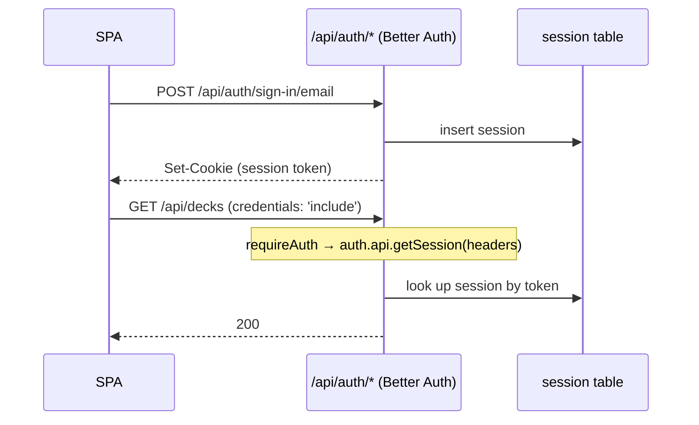

# Module 8: Authentication and privacy

**Duration:** 55 min · **Level:** Intermediate–Advanced · **Prerequisites:** [Modules 4–6](04-api-request-lifecycle.md)

Svey is operated from Germany and processes personal data (names, emails, OAuth tokens, avatars, play history). Privacy is a design input here, not a compliance afterthought. This module covers how people sign in, how secrets are protected at rest, and how an account is erased without breaking anybody else's history.

## Learning objectives

After this module you can:

- Describe the three sign-in methods and the email-verification and password-reset flows.
- Explain how the session reaches the API and how the SPA guards routes.
- Walk through token encryption: key derivation, format, legacy passthrough, and why rotating the auth secret matters.
- Walk through `deleteAccountData` and explain each step with the cascade rules from Module 6.
- List the other data-minimisation measures and where they live.

---

## Unit 1: Sign-in methods

All configuration lives in [`lib/auth.ts`](../../apps/api/lib/auth.ts), using **Better Auth** with the Postgres pool and `generateId: 'uuid'`.

| Method | Configuration | Notes |
|---|---|---|
| **Discord** | `socialProviders.discord` with `prompt: 'none'` | Returning users skip Discord's consent screen |
| **Google** | `socialProviders.google`, no forced prompt | `prompt: 'none'` is avoided on purpose: it errors when interaction is needed |
| **Email + password** | `emailAndPassword.enabled`, `maxPasswordLength: 128`, **`requireEmailVerification: true`** | Sign-up returns **no session**; a verification email is sent. Signing in unverified re-sends it and returns 403 |

**Verification:** `emailVerification.sendOnSignUp` + `autoSignInAfterVerification`. Clicking the link signs the user in and lands them on the sign-up `callbackURL` (`/home`).

**Password reset:** `sendResetPassword` emails a link to the SPA's public `/reset-password` page with a `?token=` parameter ([`ResetPasswordView.vue`](../../apps/frontend/src/views/ResetPasswordView.vue)).

Emails are built by `actionEmail()` in [`lib/email.ts`](../../apps/api/lib/email.ts) (plain text + branded HTML, with the URL always present as text) and sent fire-and-forget via SMTP (Brevo in production).

OAuth redirect URIs in production are `https://svey.app/api/auth/callback/discord` and `…/google`.

---

## Unit 2: Sessions end to end



- The SPA always sends cookies: `credentials: 'include'` in [`lib/api.ts`](../../apps/frontend/src/lib/api.ts).
- The frontend auth client is `createAuthClient({ baseURL: VITE_API_URL })` from `better-auth/vue` ([`lib/auth-client.ts`](../../apps/frontend/src/lib/auth-client.ts)).
- Route guards ([`router/index.ts`](../../apps/frontend/src/router/index.ts)) call `authClient.getSession()` on navigation to any route marked `requiresAuth` (→ `/auth` if absent) or `guestOnly` (→ `/home` if present).
- `trustedOrigins` (Better Auth) and the CORS plugin both allow `FRONTEND_URL` plus `localhost:5173`. In production everything is one origin anyway.

> A route guard is UX, not security. Every protected endpoint checks the session again through `requireAuth`, and services check access (Module 5).

---

## Unit 3: OAuth tokens encrypted at rest

Better Auth stores provider tokens in `oauth_account`. Svey encrypts them before they reach the database, via **database hooks**:

```ts
databaseHooks: {
  account: {
    create: { before: async (account) => ({ data: encryptAccountTokens(account) }) },
    update: { before: async (account) => ({ data: encryptAccountTokens(account) }) },
  },
  user: {
    create: { before: async (user) => ({ data: stampTermsAcceptance(user) }) },
  },
},
```

The crypto lives in [`lib/token-crypto.ts`](../../apps/api/lib/token-crypto.ts):

```ts
const PREFIX = 'enc:v1:'
const IV_BYTES = 12
const TAG_BYTES = 16

const KEY = Buffer.from(crypto.hkdfSync(
  'sha256',
  env.BETTER_AUTH_SECRET,
  Buffer.from('svey:oauth-token'),      // salt
  Buffer.from('token-encryption-v1'),   // info: separates this key from the auth secret
  32,
))

export function encryptToken(value: string): string {
  if (isEncryptedToken(value)) return value // never double-wrap
  const iv = crypto.randomBytes(IV_BYTES)
  const cipher = crypto.createCipheriv('aes-256-gcm', KEY, iv)
  const ciphertext = Buffer.concat([cipher.update(value, 'utf8'), cipher.final()])
  const tag = cipher.getAuthTag()
  return PREFIX + Buffer.concat([iv, tag, ciphertext]).toString('base64')
}

export function decryptToken(value: string): string {
  if (!isEncryptedToken(value)) return value // legacy plaintext
  // … split iv | tag | ciphertext, setAuthTag, decrypt
}
```

| Design choice | Reason |
|---|---|
| **AES-256-GCM** | Authenticated encryption: tampering makes decryption throw (there's a test for that) |
| **Fresh random IV** per value | Equal tokens encrypt differently |
| **HKDF from `BETTER_AUTH_SECRET`** | No extra secret to manage; the `info` string makes the derived key distinct from the auth secret |
| **Versioned prefix `enc:v1:`** | Lets a future `v2` coexist; lets code tell ciphertext from plaintext |
| **Passthrough for unprefixed values** | Backward compatible with rows written before encryption existed; the [`encrypt-tokens`](../../apps/api/jobs/encrypt-tokens.ts) job backfilled them |

> **Operational consequence:** the key is derived from `BETTER_AUTH_SECRET`. Rotating that secret invalidates sessions *and* makes stored OAuth tokens undecryptable. Treat a rotation as a planned operation, not a casual config change.

---

## Unit 4: Consent audit trail

Every new user is stamped with the terms they accepted:

```ts
function stampTermsAcceptance<T>(user: T) {
  return { ...user, termsAcceptedAt: new Date(), termsVersion: CURRENT_TERMS_VERSION }
}
```

- The fields are declared as `additionalFields` with **`input: false`**, so a client can't set them.
- `CURRENT_TERMS_VERSION` in [`lib/constants.ts`](../../apps/api/lib/constants.ts) matches the "Stand" date on the legal pages. **Bump it whenever the legal texts change.**
- Users created before migration `006` have `NULL`. Nothing is backfilled, by design.

---

## Unit 5: Account deletion (GDPR Art. 17)

The user types `DELETE` in [`ProfileView.vue`](../../apps/frontend/src/views/ProfileView.vue), which calls `authClient.deleteUser()`. Better Auth then runs the hook:

```ts
deleteUser: {
  enabled: true,
  beforeDelete: async (user) => { await deleteAccountData(db, user.id) },
},
```

`session.freshAge: 0` disables Better Auth's "recent login" requirement. No deletion-verification email is configured, and OAuth users have no password to re-enter, so they could otherwise never delete an account on an older session. The typed `DELETE` confirmation is the gate instead.

### What `deleteAccountData` does

[`services/account.service.ts`](../../apps/api/services/account.service.ts), in one transaction:

| Step | Action | Why (Module 6 cascades) |
|---|---|---|
| 1 | Find the user's memberships and their `game_player` seats | |
| 2 | **Delete** the user's own `survey_response` rows | Personal authored content |
| 3 | Set `guest_name = 'Deleted player'` on those seats | Recaps for other members stay readable, without the name |
| 4 | **Delete** the memberships | `game_player.playgroup_member_id` becomes null via `SET NULL` |
| 5 | Reassign `game.host_user_id` and `playgroup.created_by` to the **sentinel user** | Those FKs have no `ON DELETE`, so they would block the user delete |
| 6 | Decks used in any game → reassign to the sentinel; unused decks → delete | `deck.owner_user_id` **cascades**, so used decks would vanish and break history |

After the transaction, avatar files are removed from disk (best effort). Then Better Auth deletes the user, and `session`, `oauth_account` and `notification` cascade.

This is GDPR Art. 17 erasure with the Art. 17(3) retention exception: other members' shared history stays, but no longer identifies the person.

### The nightly cleanup

[`plugins/scheduled-jobs.ts`](../../apps/api/plugins/scheduled-jobs.ts) runs [`cleanupOrphanedData`](../../apps/api/services/cleanup.service.ts) at **03:30 Europe/Berlin** (`node-cron`, `noOverlap: true`, skipped under test):

1. **Empty pods**: pods with no membership pointing at a real account. Their games are deleted first (no cascade on `game.playgroup_id`), then the pods.
2. **Orphaned decks**: owned by the sentinel and no longer referenced by any game.

It's idempotent, runs in-process and assumes **a single API instance**. If you ever scale out, move it to an external scheduler (the [`cleanup-orphans`](../../apps/api/jobs/cleanup-orphans.ts) script exists for that).

---

## Unit 6: Data minimisation everywhere else

| Measure | Where |
|---|---|
| Client IP and port stripped from production request logs | `logger.redact` in [`server.ts`](../../apps/api/server.ts) |
| Host logs kept 14 days | journald `MaxRetentionSec=14d` in [`cloud-init.yaml`](../../scripts/cloud-init.yaml); containers log to journald |
| Fonts self-hosted (no Google Fonts request) | `@fontsource/*` imports in [`main.ts`](../../apps/frontend/src/main.ts) |
| Card art proxied, so browsers never contact Scryfall (avoids an EU→US IP transfer) | [`routes/cards/index.ts`](../../apps/api/routes/cards/index.ts), Module 9 |
| Operator address not in the repo; injected at build time | `VITE_LEGAL_*` → [`lib/legal-contact.ts`](../../apps/frontend/src/lib/legal-contact.ts); deploy fails if secrets are missing |
| Backups encrypted with `age`; the server holds only the public key | [`scripts/backup-db.sh`](../../scripts/backup-db.sh), Module 16 |
| Internal records (e.g. the Art. 30 register) never committed | `docs/private/` is gitignored |

**When you add personal data** (a new column, a new upload, a new log line), ask: does deletion handle it? Is it logged? Does it leave the EU? Update `deleteAccountData` in the same PR.

---

## Summary

- Discord, Google, or verified email + password; sessions are cookies checked by `requireAuth` on every protected request.
- OAuth tokens are AES-256-GCM encrypted with a key derived from `BETTER_AUTH_SECRET`; rotating that secret is a big deal.
- Account deletion anonymises shared history and reassigns blocking or cascading records to a sentinel user before Better Auth deletes the user.
- A nightly in-process job garbage-collects empty pods and orphaned decks.

## Knowledge check

**1. A user signs up with email and password. What do they get back?**

- A) A session cookie; verification is optional
- B) No session; a verification email is sent, and signing in before verifying returns 403
- C) A session limited to read-only routes
- D) A magic link instead of a password

<details><summary>Answer</summary>

**B.** `requireEmailVerification: true`.
</details>

**2. Why does account deletion reassign decks used in games instead of deleting them?**

- A) To keep them for the deleted user if they come back
- B) `game_player.deck_id` would block the delete, and `deck.owner_user_id` cascading would otherwise remove decks other players' history references
- C) Archidekt requires it
- D) To keep stats for the deleted user

<details><summary>Answer</summary>

**B.** Used decks move to the sentinel user so past games stay intact. Unused decks are deleted.
</details>

**3. Ops wants to rotate `BETTER_AUTH_SECRET` after a suspected leak. Besides logging everyone out, what else happens?**

- A) Nothing else
- B) Stored OAuth tokens become undecryptable, because the encryption key is derived from that secret
- C) All passwords must be reset
- D) Migrations rerun

<details><summary>Answer</summary>

**B.** HKDF derives the token key from the auth secret. Plan the rotation, and expect users to re-link providers if the tokens are needed.
</details>

**4. You add `deck.private_notes` (free text written by the owner). What else must the PR change for privacy?**

- A) Nothing; decks aren't personal data
- B) Make sure account deletion handles it: reassigned decks keep their content, so the notes need clearing in `deleteAccountData`
- C) Encrypt it with `encryptToken`
- D) Add it to the backup exclude list

<details><summary>Answer</summary>

**B.** Used decks survive deletion under the sentinel user, so personal content on them must be cleared or anonymised explicitly.
</details>

**5. Why is `session.freshAge` set to `0`?**

- A) To make sessions never expire
- B) So OAuth users, who have no password and no deletion-verification email, can still delete their account on an older session; a typed `DELETE` confirmation gates it instead
- C) To speed up session lookups
- D) It's Better Auth's default

<details><summary>Answer</summary>

**B.** Without it, a stale session would require re-authentication that OAuth-only users can't complete in this flow.
</details>

---

**Next:** [Module 9: Archidekt and Scryfall →](09-integrations-archidekt-scryfall.md)
