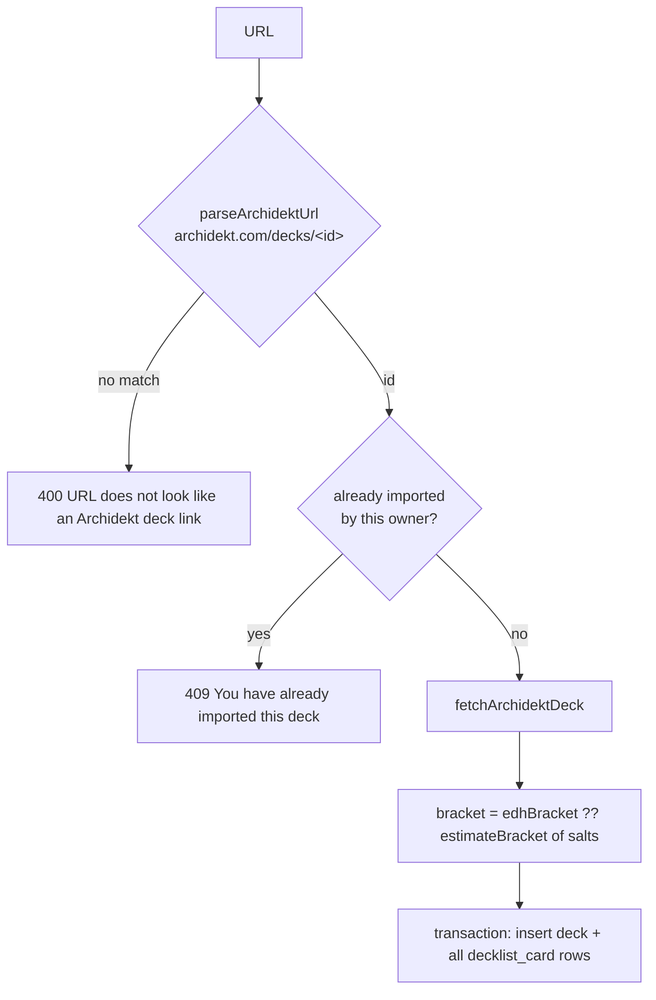

# Module 9: Archidekt and Scryfall

**Duration:** 40 min · **Level:** Intermediate · **Prerequisites:** [Module 5](05-services-and-authorization.md), [Module 6](06-database-schema.md)

Svey depends on two third-party APIs it doesn't control. This module shows the defensive patterns used for both: validate everything, never delete data because upstream changed, cache aggressively, and keep visitors' browsers away from third parties.

## Learning objectives

After this module you can:

- Trace a deck import and a re-sync, including the "deleted upstream" path.
- Explain how color identity, commanders and the bracket are derived.
- Explain how the card-art proxy caches, deduplicates concurrent requests and writes atomically.
- Explain why the card routes are public and why that is safe.
- Credit illustrators correctly when you render card art.

---

## Unit 1: Archidekt import

**Flow** (`POST /api/decks/import { url }` → [`deck.service.importDeck`](../../apps/api/services/deck.service.ts)):



[`lib/archidekt.ts`](../../apps/api/lib/archidekt.ts) is the client. Its error handling is worth copying:

```ts
export async function fetchArchidektDeck(archidektId: string): Promise<ParsedArchidektDeck> {
  let raw: unknown
  try {
    const res = await fetch(`https://archidekt.com/api/decks/${archidektId}/`, { headers: { Accept: 'application/json' } })
    if (res.status === 404) throw Errors.notFound(`Archidekt deck ${archidektId} not found`)
    if (!res.ok) throw new Error(`Archidekt returned ${res.status}`)
    raw = await res.json()
  } catch (err) {
    if (err instanceof Error && 'statusCode' in err) throw err      // our AppError: rethrow
    throw Errors.badRequest('Could not reach Archidekt. Check the URL and try again.')
  }

  const parsed = ArchidektDeckSchema.safeParse(raw)
  if (!parsed.success) throw Errors.badRequest('Unexpected response from Archidekt API.')
  // … map cards
}
```

- The response is typed `unknown` until **Zod** (`ArchidektDeckSchema`) validates it. A changed upstream payload becomes a clear 400, not a `TypeError` deep in the mapping.
- Network failures and non-404 errors become a user-facing 400; a 404 stays a 404 so the sync path can react to it.

### Mapping decisions

| Output | Derived from |
|---|---|
| `scryfallId` | `card.oracleCard.uid`, which is the **oracle_id** |
| `isCommander` | the card's Archidekt `categories` include `'Commander'` |
| `cardType` | first entry of `oracleCard.types` |
| `colorIdentity` | the union of the **commanders'** color identities; if no card is tagged Commander, the first **Legendary** card. Normalised `White → W` etc. and ordered `W U B R G` |
| `salt` | `oracleCard.salt ?? 0` |
| `edhBracket` | Archidekt's own bracket if the user set one |

### The bracket estimate

[`lib/bracket-estimator.ts`](../../apps/api/lib/bracket-estimator.ts) maps the **mean** salt score to a bracket:

```ts
export function estimateBracket(saltScores: number[]): number {
  if (saltScores.length === 0) return 2
  const avg = saltScores.reduce((sum, s) => sum + s, 0) / saltScores.length
  if (avg < 0.5) return 1
  if (avg < 1.0) return 2
  if (avg < 1.5) return 3
  if (avg < 2.5) return 4
  return 5
}
```

Archidekt's `edhBracket` wins when present; the user's `bracketOverride` beats both (`bracket = override ?? estimated`). The mean is a deliberately rough heuristic. One 4.0-salt card among nine 0.0 cards stays bracket 1, and a test documents that.

---

## Unit 2: Re-sync and "deleted upstream"

`POST /api/decks/:id/sync` ([`syncDeck`](../../apps/api/services/deck.service.ts)):

```ts
try {
  parsed = await fetchArchidektDeck(row.archidektId)
} catch (err) {
  if (err instanceof Error && 'statusCode' in err && (err as { statusCode: number }).statusCode === 404) {
    await dbClient.update(deck).set({ archidektDeleted: true }).where(eq(deck.id, deckId))
    try {
      await notificationService.createNotification(dbClient, row.ownerUserId, {
        type: 'deck_archidekt_deleted',
        title: `${row.name} was deleted on Archidekt`,
        body:  'It is still here, but will no longer sync.',
        params: { deck: row.name },
        deckId,
      })
    } catch (notifyErr) { console.error('Failed to emit deck_archidekt_deleted notification', notifyErr) }
    throw Errors.notFound('Deck no longer exists on Archidekt.')
  }
  throw err
}
// success: one transaction updates the deck (name, colors, bracket, archidektDeleted=false, lastSyncedAt)
// and replaces every decklist_card row (delete all, insert all)
```

Rules encoded here (also in `CLAUDE.md`):

- Sync is **one-way** (Archidekt → Svey) and **manual**.
- A deck that disappears upstream is **flagged, never deleted**. Its games, stats and the user's override stay. A later successful sync clears the flag.
- Card rows are replaced wholesale inside a transaction, so a failure mid-way leaves the old list intact.
- A sync also refreshes `bracket_estimated`, but never touches `bracket_override`.

---

## Unit 3: Scryfall card art proxy

The browser never talks to Scryfall. Images come from `GET /api/cards/art?oracleId=…|name=…&version=art_crop`, served by [`lib/scryfall.ts`](../../apps/api/lib/scryfall.ts).

### Why public, and why safe

From [`routes/cards/index.ts`](../../apps/api/routes/cards/index.ts):

> Public on purpose (no `requireAuth`): it returns only public MTG card art keyed by a Scryfall oracle id or card name, never an arbitrary URL, so it can't be abused as an open proxy. Routing card images through here means the visitor's browser never contacts Scryfall directly, avoiding the EU→US transfer of their IP.

Inputs are constrained by Zod: `oracleId` must be a UUID, `name` 1–200 chars, `version` one of a fixed list. There is no way to make the server fetch an arbitrary host.

### The cache

```ts
export async function getCardArt(ref: CardRef, version: CardArtVersion = 'art_crop'): Promise<CardArt> {
  const key = cacheKey(ref, version)                  // oracle-<id>_art_crop.jpg or name-<sha1>_….jpg
  const filePath = path.join(CARD_ART_DIR, key)

  try { return { data: await fsp.readFile(filePath), contentType } }   // ① disk hit
  catch { /* miss */ }

  const existing = inFlight.get(key)                  // ② someone is already fetching it
  if (existing) return existing

  const task = fetchAndCache(ref, version, filePath, contentType).finally(() => inFlight.delete(key))
  inFlight.set(key, task)
  return task
}
```

| Technique | Problem it solves |
|---|---|
| **Disk cache** under `UPLOADS_DIR/card-art` (persistent volume) | Art is immutable per card and size, so it never needs invalidation; survives restarts |
| **In-flight map** of promises | Four tiles asking for the same commander on a cold cache → **one** Scryfall request |
| **Write to `*.tmp`, then `rename`** | A crash mid-write can't leave a truncated file that later reads serve as valid |
| **`AbortSignal.timeout(8000)`** | A slow Scryfall can't hang requests forever |
| **`User-Agent: Svey/1.0 (+https://svey.app)`** | Scryfall asks clients to identify themselves and to cache images, and Svey does both |
| **`Cache-Control: public, max-age=2592000, immutable`** | Browsers cache art for 30 days |

**Resolving an oracle id.** Scryfall's `/cards/:id` takes a *printing* id. An oracle id needs a search: `cards/search?q=oracleid:<id>&unique=cards`, then the URL is taken from `image_uris[version]`, or from `card_faces[0].image_uris` for double-faced cards. By name, `cards/named?exact=…&format=image` redirects straight to the image.

### Illustrator credit (required)

Scryfall requires that the illustrator be identifiable wherever its `art_crop` is shown. `GET /api/cards/meta` returns `{ artist }`, cached the same way as JSON. Unknown cards cache `{ artist: null }` so they aren't re-queried.

On the frontend, [`useCardStore`](../../apps/frontend/src/stores/useCardStore.ts) caches artists per session and reserves the key synchronously to avoid duplicate fetches:

```ts
async function fetchArtist(ref: CardRef): Promise<void> {
  const key = refKey(ref)
  if (key in artists.value) return
  artists.value[key] = null          // reserve before awaiting
  const res = await api.get<{ artist: string | null }>(`/cards/meta?${q}`)
  artists.value[key] = res.artist
}
```

The tracker resolves credits when the game menu opens and lists them there; the deck detail hero credits its art. **If you render card art somewhere new, add the credit too.**

To put art in an `` or CSS background, use `apiUrl('/cards/art?…')` from [`lib/api.ts`](../../apps/frontend/src/lib/api.ts), never a Scryfall URL.

---

## Summary

- Third-party payloads are `unknown` until Zod validates them; upstream failures become clear 4xx errors.
- Archidekt sync is manual and one-way; a deck deleted upstream is flagged and the owner notified, never deleted.
- Bracket = override ?? Archidekt's bracket ?? mean-salt estimate.
- Card art is proxied, disk-cached, deduplicated and written atomically; every rendering of art credits the illustrator.

## Knowledge check

**1. Archidekt returns HTTP 503 during an import. What does the user see?**

- A) 500 Internal server error
- B) 400 "Could not reach Archidekt. Check the URL and try again."
- C) 404 Not found
- D) The import succeeds with an empty list

<details><summary>Answer</summary>

**B.** Non-404 failures throw a plain `Error` inside the `try`, which the `catch` converts to `Errors.badRequest`.
</details>

**2. A user syncs a deck that was deleted on Archidekt. Which statement is true?**

- A) The deck and its games are deleted
- B) The deck is flagged `archidekt_deleted = true`, the owner gets a notification, and the request returns 404
- C) Nothing changes
- D) The deck is archived

<details><summary>Answer</summary>

**B.** Flag, notify, keep everything.
</details>

**3. Four player tiles request the same uncached commander art simultaneously. How many Scryfall requests happen?**

- A) Four
- B) One for the image (plus one search if requested by oracle id), shared through the in-flight map
- C) Zero; art is bundled
- D) Eight

<details><summary>Answer</summary>

**B.** The first request stores its promise in `inFlight`; the others await the same promise.
</details>

**4. Why can't `/api/cards/art` be abused as an open proxy?**

- A) It's behind `requireAuth`
- B) It accepts only a UUID oracle id or a bounded card name and a fixed size list, and builds Scryfall URLs itself, so no arbitrary URL can be fetched
- C) Caddy blocks it
- D) It rate-limits per IP

<details><summary>Answer</summary>

**B.** The server constructs the upstream URL; the client only chooses which card.
</details>

**5. You're adding commander art to the pod standings rows. What else must you add?**

- A) Nothing
- B) The illustrator credit for that art, e.g. via `useCardStore().fetchArtist` / `artistFor`
- C) A Scryfall API key
- D) A new migration

<details><summary>Answer</summary>

**B.** Scryfall's terms require the artist to be identifiable wherever `art_crop` is rendered.
</details>

---

**Next:** [Module 10: Stats and aggregations →](10-stats-and-aggregations.md)
