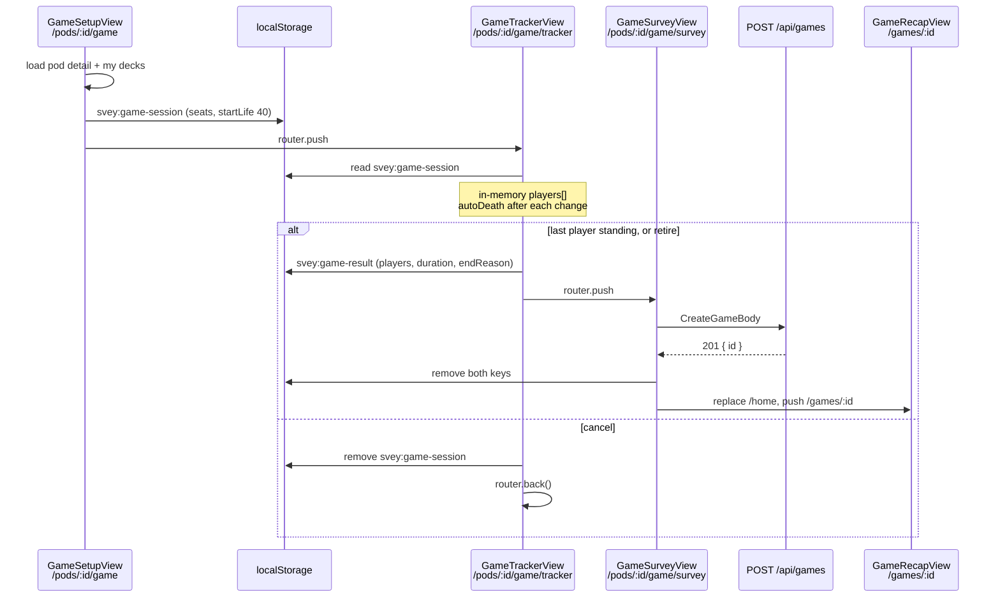

# Module 12: The game session flow

**Duration:** 60 min · **Level:** Intermediate–Advanced · **Prerequisites:** [Module 11](11-frontend-architecture.md); [Module 1](01-welcome-to-svey.md) Commander rules

This is the critical path of the product: the flow that runs at the table with four people watching one phone. It spans three views, two `localStorage` keys, a set of pure rule functions, and one API call. Read the real files alongside this page.

## Learning objectives

After this module you can:

- Trace a game from setup to recap, naming every view, storage key and request.
- Explain how `autoDeath` is applied after every mutation and when the game ends automatically.
- Explain the difference between end, retire and cancel, and what each persists.
- Map tracker death causes to API death causes.
- Describe how the API turns relative seconds into timestamps.
- List the gaps and edge cases of the current flow.

---

## Unit 1: The whole flow



The two keys are constants in [`lib/game-tracker.ts`](../../apps/frontend/src/lib/game-tracker.ts):

```ts
export const SESSION_KEY = 'svey:game-session'   // written by setup: who sits where with which deck
export const RESULT_KEY  = 'svey:game-result'    // written by the tracker: the final state for the survey
```

---

## Unit 2: Setup

[`GameSetupView.vue`](../../apps/frontend/src/views/GameSetupView.vue) loads the pod detail and the user's decks in parallel, then manages a list of seats (2–6, default 4):

```ts
const blank = (): GsSeat => ({ playerId: null, isGuest: false, guestName: '', deckId: null })
const seats = ref<GsSeat[]>([blank(), blank(), blank(), blank()])

const filledSeats   = computed(() => seats.value.filter(s => s.playerId || s.isGuest))
const seatsWithDeck = computed(() => filledSeats.value.filter(s => s.deckId))
const canStart      = computed(() =>
  filledSeats.value.length >= 2 && seatsWithDeck.value.length === filledSeats.value.length,
)
```

- A seat holds a **member** (`playerId` = membership id) or a **guest** (`guestName`), never both.
- A member can sit in only one seat (`takenIds` filters the player sheet).
- The deck sheet offers the **signed-in user's non-archived decks**. That's how borrowing works in practice: the phone's owner hands out decks, and any seat can take any of them.
- The CTA explains what's missing ("seat 2 players", "pick N decks") until `canStart`.

`startGame()` denormalises everything the tracker needs into the session (names, deck colors, commander name), so the tracker needs no API call:

```ts
const session: GameSessionData = {
  podId,
  startLife: 40,
  seats: seats.value.map(s => ({
    playerId: s.playerId, playerName: member?.name ?? '', isYou: member?.you ?? false,
    isGuest: s.isGuest, guestName: s.guestName,
    deckId: s.deckId, deckName: deck?.name ?? null, deckColors: deck?.colors ?? [], deckCommander: deck?.commander ?? null,
  })),
}
localStorage.setItem(SESSION_KEY, JSON.stringify(session))
router.push(`/pods/${podId}/game/tracker`)
```

---

## Unit 3: The tracker's state and layout

[`GameTrackerView.vue`](../../apps/frontend/src/views/GameTrackerView.vue) reads the session once and builds `GtPlayer`s:

```ts
export type GtPlayer = {
  seatIdx: number; name: string; isYou: boolean; isGuest: boolean
  deck: { id: string; colors: string[]; commander: string } | null
  life: number; poison: number
  cmdrDmg: Record<number, number>     // attackerSeatIdx → damage taken from that commander
  dead: boolean; deathAt: number | null; deathCause: DeathCause | null
}
```

- **No session in storage?** The tracker shows a seeded **demo game** (four fake players mid-game, `podId: 'tuesday'`). It's useful for UI work; don't mistake it for real data.
- **The clock** is a `setInterval` that increments `elapsed` every second unless `paused` or `ended`. Death times (`deathAt`) are seconds since the start.
- **Layout** comes from a pure function:

```ts
export function gridForCount(n: number): { rows: number[][]; rotated: boolean[] } {
  if (n <= 1) return { rows: [[0]], rotated: [false] }
  const half = Math.floor(n / 2)
  const top = Array.from({ length: half }, (_, i) => i)
  const bottom = Array.from({ length: n - half }, (_, i) => half + i)
  return { rows: [top, bottom], rotated: Array.from({ length: n }, (_, i) => i < half) }
}
```

The top bank is rotated 180° (`transform: rotate(180deg)` on `GtPlayerTile`) so players across the table read their own tile. With an odd count the extra seat goes to the bottom bank. `GtCenterBar` sits on the seam: clock, pause, alive count, menu.

---

## Unit 4: Mutations and `autoDeath`

Every change goes through `updatePlayer`:

```ts
function updatePlayer(idx: number, patch: Partial<GtPlayer>) {
  const p = players.value[idx]
  if (!p) return
  const next: GtPlayer = { ...p, ...patch }
  if (patch.cmdrDmg) next.cmdrDmg = { ...p.cmdrDmg, ...patch.cmdrDmg }
  const cause = autoDeath(next)
  if (cause && !next.dead) {
    next.dead = true
    next.deathAt = elapsed.value
    next.deathCause = cause
  }
  players.value[idx] = next
  const alive = players.value.filter(p => !p.dead)
  if (!ended.value && alive.length === 1 && players.value.length > 1) {
    onEndGame()                       // last player standing → straight to the survey
  }
}
```

And the rule itself:

```ts
export function autoDeath(p: GtPlayer): DeathCause | null {
  if (p.dead) return null                                   // never re-kill
  if (p.life <= 0) return 'life'
  if (p.poison >= 10) return 'poison'
  const vals = Object.values(p.cmdrDmg)
  if (vals.length && Math.max(...vals) >= 21) return 'cmdr' // per commander, never summed
  return null
}
```

| Interaction | Effect |
|---|---|
| Tap +/− on a tile | `life ± delta`. No floor; negative life is allowed and kills |
| Poison button | `poison + 1`, capped at 15 |
| Commander damage sheet | Sets `cmdrDmg[attacker]` (0–99) for the target. It does **not** change life. Players adjust life on the tile themselves |
| Manual elimination (card effects) | `dead`, cause `manual` |
| Concede (with reasons) | `dead`, cause `concede`. The concede reasons are UI only and not sent to the API |

Precedence when several apply at once is life → poison → commander damage, and a test pins it.

> Commander-damage changes go through a near-duplicate of `updatePlayer` (`onCmdrDmgChange`). If you change the death/end logic, change both, or better, consolidate them.

---

## Unit 5: End, retire, cancel

All three start in the game menu ([`GtGameMenu.vue`](../../apps/frontend/src/components/game-tracker/GtGameMenu.vue)) or the confirm sheet ([`GtConcedeSheet.vue`](../../apps/frontend/src/components/game-tracker/GtConcedeSheet.vue)):

| Action | Available when | What happens | Saved? |
|---|---|---|---|
| **End game** | Exactly one player alive (button disabled while `aliveCount > 1`); also triggered **automatically** by `updatePlayer` | `finishGame('won')` | Yes, `endReason: 'won'` |
| **Retire** | Any time; pick reasons (`time`, `stall`, `left`, `vibe`, `rules`, `other`) | `finishGame('abandoned', reasons)` | Yes, `endReason: 'abandoned'` + `abandonReasons` |
| **Cancel** | Any time; pick reasons (UI only) | Remove `SESSION_KEY`, `router.back()` | **No** |

```ts
function finishGame(endReason: GameResultData['endReason'], abandonReasons?: string[]) {
  ended.value = true
  closeSheet()
  const result: GameResultData = { podId, players: players.value, durationSec: elapsed.value, endReason, abandonReasons }
  localStorage.setItem(RESULT_KEY, JSON.stringify(result))
  void router.push(`/pods/${podId}/game/survey`)
}
```

The tracker never produces `endReason: 'draw'`, though the API accepts it.

---

## Unit 6: Survey and save

[`GameSurveyView.vue`](../../apps/frontend/src/views/GameSurveyView.vue) reads **both** keys (it redirects to `/home` if either is missing) and walks the players one by one: fun 1–5, agency 1–5, optional takeaway, **Skip** or **Next/Finish**.

Then it builds the request. Two translations happen here.

**Winner:** only in a `won` game with exactly one survivor:

```ts
function isWinner(idx: number): boolean {
  if (!result.value || result.value.endReason !== 'won') return false
  const alive = result.value.players.filter(p => !p.dead)
  return alive.length === 1 && alive[0]?.seatIdx === result.value.players[idx]?.seatIdx
}
```

**Death cause:** the tracker uses short UI causes; the API uses the database enum:

| Tracker (`lib/game-tracker.ts`) | API / DB (`death_cause`) |
|---|---|
| `life` | `life` |
| `cmdr` | `cmdr_dmg` |
| `poison` | `poison` |
| `manual` | `special` |
| `concede` | `conceded` |
| `null` (survived) | `none` |

```ts
try {
  const gameId = await gameStore.createGame(body)
  localStorage.removeItem(SESSION_KEY)
  localStorage.removeItem(RESULT_KEY)
  await router.replace('/home')            // so "back" from the recap goes home, not to the survey
  void router.push(`/games/${gameId}`)
} catch {
  isSubmitting.value = false               // store shows createError; the user can retry
}
```

> **Watch out:** the **×** in the survey header (`onAbandon`) clears both keys and goes home **without saving**. Once past the tracker, closing the survey discards the game.

### On the server

`createGame` (Module 5) verifies membership, then in one transaction:

```ts
const startedAt = new Date(Date.now() - body.durationSec * 1000)
const endedAt   = new Date()
// … insert game
const diedAt = p.deathAt != null ? new Date(startedAt.getTime() + p.deathAt * 1000) : null
// … insert game_player with turnOrder = index; survey_response only if something was answered
```

The client sends **relative** seconds; the server anchors them to *its own* clock at save time. So `started_at` reflects when the game was saved minus its duration (pauses included, since the clock stops while paused, so the "duration" is play time).

---

## Unit 7: Known gaps and edge cases

| Gap | Detail | Direction |
|---|---|---|
| **Reload loses the game** | Tracker state is only in memory; the session survives, so a reload restarts at 40 life and 00:00 | Persist `players`/`elapsed` to `localStorage` after each mutation and offer "resume" (the top known gap) |
| **Commander damage not stored** | `cmdrDmg` isn't in the request; `commander_damage` table unused | Requires snapshotting decklists (`game_decklist_card`) first, because the table references snapshot cards |
| **Survey × discards** | No confirm before dropping a finished game | Confirm dialog, or keep `RESULT_KEY` until explicitly discarded |
| **Duplicated death logic** | `updatePlayer` and `onCmdrDmgChange` | Consolidate |
| **No `draw`** | API supports it; tracker can't produce it | Product decision first |

---

## Try it

1. Start a 3-player game locally. Open DevTools → Application → Local Storage and watch `svey:game-session` appear.
2. Kill one player via commander damage (21 from one opponent) and one via poison. Watch the tracker jump to the survey and `svey:game-result` appear.
3. In the Network tab, inspect the `POST /api/games` body. Find `cmdr_dmg`, `poison` and `none` in it.
4. Reload the tracker mid-game and confirm the life totals reset (the known gap).
5. **Design exercise (no code):** sketch how you'd persist tracker state. Which key? When to write? How would setup detect an unfinished game? What must be cleared on cancel, retire and save?

---

## Summary

- Setup writes `svey:game-session`; the tracker runs in memory; end/retire write `svey:game-result`; the survey POSTs once and clears both.
- `autoDeath` runs after every change; the last player standing triggers the end automatically.
- End and retire are saved (`won` / `abandoned` + reasons); cancel saves nothing, and neither does closing the survey.
- Tracker causes map to API causes (`cmdr`→`cmdr_dmg`, `manual`→`special`, `concede`→`conceded`).

## Knowledge check

**1. Which deck choices does the setup screen offer for a seat?**

- A) Each member's own decks
- B) All decks in the pod
- C) The signed-in user's non-archived decks
- D) Any Archidekt deck by URL

<details><summary>Answer</summary>

**C.** `setupDecks` is built from `deckStore.decks` (the caller's decks), excluding archived ones.
</details>

**2. A player at 5 life takes 6 commander damage from one opponent, entered on the commander-damage sheet. What happens?**

- A) They die from life loss
- B) Their commander damage from that opponent increases by 6; life stays 5 unless someone also changes it on the tile
- C) They die from commander damage
- D) Life goes to −1 automatically

<details><summary>Answer</summary>

**B.** The sheet only updates `cmdrDmg`. They die only if a single commander reaches 21 or life is reduced to 0.
</details>

**3. A player is eliminated via the manual-elimination sheet. What `death_cause` is stored?**

- A) `manual`
- B) `special`
- C) `none`
- D) `conceded`

<details><summary>Answer</summary>

**B.** `mapDeathCause('manual')` → `'special'`.
</details>

**4. The table retires a game after 40 minutes. What is saved?**

- A) Nothing
- B) A game with `endReason: 'abandoned'`, the chosen reason ids, all seats, no winner, and any survey answers
- C) A game with a winner chosen by highest life
- D) Only the survey

<details><summary>Answer</summary>

**B.** Retire goes through the survey and is saved; `isWinner` is false for everyone because `endReason !== 'won'`.
</details>

**5. The survey's POST fails because the network dropped. What state are you in?**

- A) The game is lost
- B) Both keys are still in `localStorage`, the store shows `createError`, and the user can tap Finish again
- C) The game was saved twice
- D) The tracker restarts

<details><summary>Answer</summary>

**B.** Keys are removed only after a successful save; `isSubmitting` resets in the `catch`.
</details>

**6. A player died at `deathAt = 600` in a game saved with `durationSec = 3000`. What's `died_at` relative to `ended_at`?**

- A) 600 s after `ended_at`
- B) 2400 s before `ended_at` (i.e. 600 s after `started_at = ended_at − 3000 s`)
- C) Equal to `ended_at`
- D) Null

<details><summary>Answer</summary>

**B.** `started_at = now − duration`, `died_at = started_at + deathAt`.
</details>

---

**Next:** [Module 13: Design system and i18n →](13-design-system-and-i18n.md)
