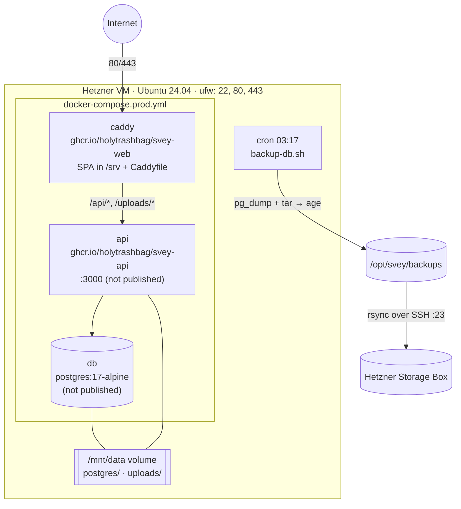
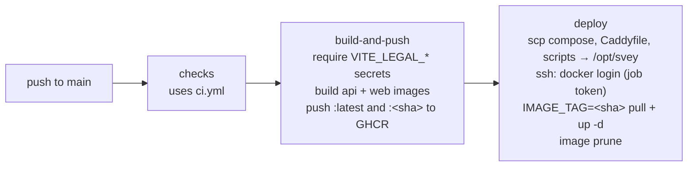

# Module 16: DevOps and production

**Duration:** 55 min · **Level:** Intermediate–Advanced · **Prerequisites:** [Modules 7](07-migrations.md), [15](15-workflow-and-releases.md); Docker basics

Production is deliberately small: one VM, three containers, one Caddyfile, one deploy workflow. Small doesn't mean careless, though. Every deploy is gated by CI, the host is hardened, logs expire, and backups are encrypted and mirrored off-site. This module walks the path from a merge to a running container, and the runbooks around it.

## Learning objectives

After this module you can:

- Explain both Docker images stage by stage.
- Describe the production Compose stack: services, networks, volumes, health checks.
- Read the Caddyfile and explain each caching rule.
- Trace the deploy workflow job by job and list the secrets it needs.
- Describe the host hardening from cloud-init.
- Run (and drill) a backup restore, and roll back a bad deploy.

---

## Unit 1: Topology



On the host, `/opt/svey` contains `docker-compose.prod.yml`, `Caddyfile`, `scripts/` (all copied by each deploy), plus `.env.prod` and `.backup.env`, which are created by hand and never in Git.

---

## Unit 2: The images

### API ([`apps/api/Dockerfile`](../../apps/api/Dockerfile))

```dockerfile
FROM node:26-alpine AS builder
RUN npm install -g corepack@0.36.0 && corepack enable     # Node 25+ no longer bundles corepack
WORKDIR /repo
COPY . .                                                  # .dockerignore keeps node_modules, dist, .env* out
RUN pnpm install --frozen-lockfile \
 && pnpm --filter api build \
 && pnpm --filter api deploy --legacy --prod /app         # self-contained bundle: prod deps + dist
RUN cp -r /app/db/migrations /app/dist/db/migrations      # tsc doesn't copy .sql

FROM node:26-alpine AS runtime
ENV NODE_ENV=production
WORKDIR /app
COPY --from=builder --chown=node:node /app /app
RUN chmod +x /app/docker-entrypoint.sh && mkdir -p /data/uploads && chown -R node:node /data
USER node                                                  # never root
EXPOSE 3000
ENTRYPOINT ["/app/docker-entrypoint.sh"]                   # migrate, then exec the server
```

- **Multi-stage:** compilers and dev dependencies stay in the builder; the runtime image has only the bundle.
- **`pnpm deploy --prod`** extracts one workspace package with its production dependencies, which is how a monorepo app gets a standalone `node_modules`.
- **`/data/uploads` pre-created and owned by `node`**, so the mounted volume inherits the right ownership.
- **`.dockerignore`** excludes every `.env*`. Secrets are never baked into images.

### Web ([`apps/frontend/Dockerfile`](../../apps/frontend/Dockerfile))

```dockerfile
FROM node:26-alpine AS builder
# … corepack, COPY . .
ARG VITE_API_URL
ARG VITE_LEGAL_NAME   # … STREET, CITY, EMAIL, PHONE
ENV VITE_API_URL=${VITE_API_URL} …
RUN pnpm install --frozen-lockfile && pnpm --filter frontend build-only

FROM caddy:2-alpine
COPY --from=builder /repo/apps/frontend/dist /srv
```

`VITE_*` values are **build arguments** because Vite inlines them at build time. Changing `SITE_URL` or the legal details requires a rebuild, not a restart. The image uses `build-only` (no `vue-tsc`), because type-checking already ran in CI.

---

## Unit 3: The Compose stack

[`docker-compose.prod.yml`](../../docker-compose.prod.yml), condensed:

```yaml
services:
  db:
    image: postgres:17-alpine
    logging: &journald { driver: journald, options: { tag: "{{.Name}}" } }
    environment: { POSTGRES_USER: ${POSTGRES_USER}, POSTGRES_PASSWORD: ${POSTGRES_PASSWORD}, POSTGRES_DB: ${POSTGRES_DB} }
    volumes: [db_data:/var/lib/postgresql/data]
    healthcheck: { test: ["CMD-SHELL", "pg_isready -U ${POSTGRES_USER} -d ${POSTGRES_DB}"], interval: 10s }
    # no ports: only reachable on the internal network

  api:
    image: ghcr.io/holytrashbag/svey-api:${IMAGE_TAG:-latest}
    env_file: [.env.prod]
    environment:
      NODE_ENV: production
      UPLOADS_DIR: /data/uploads
      DATABASE_URL: postgresql://${POSTGRES_USER}:${POSTGRES_PASSWORD}@db:5432/${POSTGRES_DB}   # password defined once
    volumes: [uploads_data:/data/uploads]
    depends_on: { db: { condition: service_healthy } }
    expose: ["3000"]

  caddy:
    image: ghcr.io/holytrashbag/svey-web:${IMAGE_TAG:-latest}
    environment: { SITE_ADDRESS: ${SITE_ADDRESS} }
    ports: ["80:80", "443:443"]
    volumes: [./Caddyfile:/etc/caddy/Caddyfile:ro, caddy_data:/data, caddy_config:/config]

volumes:
  db_data:      { driver: local, driver_opts: { type: none, o: bind, device: ${DATA_DIR:-/mnt/data}/postgres } }
  uploads_data: { driver: local, driver_opts: { type: none, o: bind, device: ${DATA_DIR:-/mnt/data}/uploads } }
  caddy_data:   # certificates on local disk, cheap to re-issue
```

| Detail | Why |
|---|---|
| `db` and `api` publish no ports | Only Caddy faces the internet |
| `depends_on: service_healthy` | The API (and its migrations) start only when Postgres accepts connections |
| `IMAGE_TAG` | CI deploys the exact commit SHA; `latest` is the manual default |
| Bind-mounted volumes on `/mnt/data` | Data lives on an attached Hetzner volume and survives server rebuilds. The directories must exist, and the volume must be mounted (fstab) **before** the stack starts |
| journald logging | The host's 14-day retention applies to container logs too |
| `DATABASE_URL` assembled in Compose | The DB password is defined once in `.env.prod` |

Server-side configuration is `/opt/svey/.env.prod`, created from [`.env.prod.example`](../../.env.prod.example): site address/URL, Postgres credentials, `BETTER_AUTH_SECRET`/`URL`, `FRONTEND_URL`, OAuth client ids/secrets, SMTP (Brevo).

---

## Unit 4: Caddy

[`Caddyfile`](../../Caddyfile):

```caddy
{$SITE_ADDRESS} {
  encode zstd gzip

  handle /api/*     { reverse_proxy api:3000 }
  handle /uploads/* { reverse_proxy api:3000 }

  handle {
    root * /srv
    @assets path /assets/*
    header @assets Cache-Control "public, max-age=31536000, immutable"   # fingerprinted, never change

    @nocache path /index.html /sw.js /registerSW.js /manifest.webmanifest /workbox-*.js
    header @nocache Cache-Control "no-cache"                             # discover new deploys promptly

    try_files {path} /index.html                                         # SPA fallback
    file_server
  }
}
```

- `SITE_ADDRESS=svey.app` makes Caddy obtain and renew Let's Encrypt certificates automatically. `:80` works for local testing.
- The caching split is what makes PWA updates reliable: entry points revalidate, hashed assets are cached forever.

---

## Unit 5: The deploy pipeline

[`.github/workflows/deploy.yml`](../../.github/workflows/deploy.yml) runs on every push to `main` (and manually via `workflow_dispatch`):



| Property | How |
|---|---|
| **Never ship red** | The first job *is* the CI workflow (`uses: ./.github/workflows/ci.yml`) |
| **No overlapping deploys** | `concurrency: { group: deploy, cancel-in-progress: false }`; an in-flight deploy finishes |
| **No placeholder Impressum** | The build fails if any `VITE_LEGAL_*` secret is empty |
| **No long-lived registry token** | The host pulls with the deploy job's short-lived `GITHUB_TOKEN` (`packages: read`), and logs out on exit via `trap` |
| **Fast rebuilds** | Buildx with the GitHub Actions cache, scoped per image |
| **Host needs no source checkout** | Only the compose file, Caddyfile and scripts are copied |

### Secrets and variables

| Name | Kind | Purpose |
|---|---|---|
| `SSH_HOST`, `SSH_USER`, `SSH_KEY`, `SSH_PORT` | secret | SSH target (`SSH_USER=deploy`) |
| `VITE_LEGAL_NAME`, `…_STREET`, `…_CITY`, `…_EMAIL`, `…_PHONE` | secret | Impressum details baked into the SPA; stored as secrets so they're masked in public logs |
| `SITE_URL` | variable | Public origin baked into the SPA (`https://svey.app`) |

> Pulling images **manually** on the host needs your own `docker login ghcr.io` (a personal access token with `read:packages`), because the CI token expires with the job.

---

## Unit 6: Host provisioning and hardening

New servers are bootstrapped with [`scripts/cloud-init.yaml`](../../scripts/cloud-init.yaml):

| Measure | Setting |
|---|---|
| Deploy user | `deploy`, key-only, in `sudo` and `docker` groups |
| SSH | `PermitRootLogin no`, `PasswordAuthentication no`, `KbdInteractiveAuthentication no` |
| Firewall | `ufw` deny incoming except 22, 80, 443 (plus the Hetzner Cloud Firewall) |
| Brute force | `fail2ban` |
| Patching | `unattended-upgrades`, daily |
| Log retention | journald `MaxRetentionSec=14d`, `SystemMaxUse=500M` |
| Memory safety | 2 GB swap |
| Tooling | Docker + compose plugin, `age`, `rsync` |
| Backups | `/etc/cron.d/svey-backup` at 03:17 |
| Timezone | `Europe/Berlin` |

It contains **no secrets** and doesn't deploy. The first deploy comes from GitHub Actions once `.env.prod` and the repository secrets exist.

---

## Unit 7: Backups and restore

Runbook: [`docs/ops/backup-restore.md`](../ops/backup-restore.md). Script: [`scripts/backup-db.sh`](../../scripts/backup-db.sh).

```sh
dc exec -T db sh -c 'pg_dump -U "$POSTGRES_USER" -d "$POSTGRES_DB" --clean --if-exists' \
  | gzip -9 | age -r "$AGE_RECIPIENT" > "$db_out.tmp"
mv "$db_out.tmp" "$db_out"                                     # atomic: no truncated backups
tar -czf - -C "$UPLOADS_DIR" . | age -r "$AGE_RECIPIENT" > "$uploads_out.tmp" && mv …
find "$BACKUP_DIR" -name 'svey-*.age' -mtime +"$RETENTION_DAYS" -delete     # 14 days
rsync -az --delete -e "$RSYNC_RSH" "$BACKUP_DIR"/ "$STORAGEBOX_DEST"/       # off-site mirror
```

| Property | Detail |
|---|---|
| **What** | Full `pg_dump` (app + auth data) and the uploads directory |
| **Encryption is mandatory** | The script refuses to run without `AGE_RECIPIENT` |
| **Asymmetric** | The server holds only the **public** key; a compromised server can't read its own backups. The private key lives offline |
| **Where** | `/opt/svey/backups`, mirrored to a Hetzner Storage Box (port 23) |
| **Retention** | 14 days locally and off-site (`--delete` mirrors local pruning) |
| **Why not Hetzner snapshots?** | They image only the boot disk, not the attached `/mnt/data` volume |

**Restore** ([`scripts/restore-db.sh`](../../scripts/restore-db.sh)) needs the private key and asks you to type `yes`. `db` restores are destructive (`--clean`). Shred the key from the server afterwards.

**The quarterly restore drill** loads the latest dump into a throwaway `postgres:17-alpine` container and checks a few tables, without touching production. The runbook's drill log still says *pending first drill*. Running and recording it is a good onboarding task, paired with whoever holds the key.

---

## Unit 8: Operating it

| Task | How |
|---|---|
| Is it up? | `curl https://svey.app/api/health` → `{"status":"ok"}` |
| API logs | `docker compose -f docker-compose.prod.yml logs -f api`, or `journalctl CONTAINER_NAME=<name>` |
| Backup log | `/opt/svey/backup.log` |
| Roll back code | Open a `revert:` PR and merge it; it deploys like any change |
| Emergency pin to a previous image | On the host: `IMAGE_TAG=<older sha> docker compose --env-file .env.prod -f docker-compose.prod.yml up -d` (the next deploy moves it forward again) |
| Roll back the schema | Not possible. Write a new forward migration; that's why migrations must be backward compatible |
| Cleanup job | Runs in-process nightly at 03:30; logs only when it removed something |

**Single-instance assumptions** to remember before scaling out: the in-process cron job (it would run once per instance) and uploads plus the card-art cache on a local volume (each instance would see its own files).

---

## Summary

- Two multi-stage images on GHCR; the API image migrates on start and runs as `node`.
- Compose runs `caddy`, `api`, `db`; only Caddy is exposed; data lives on a bind-mounted volume.
- Deploy = CI → build and push (tagged by SHA) → SSH pull and `up -d`, with no long-lived registry token.
- Hosts are hardened by cloud-init; logs expire after 14 days.
- Backups are nightly, `age`-encrypted to an offline key, mirrored off-site, and restorable with a script. Drill them.

## Knowledge check

**1. You change `SITE_URL` in the repository variables. What's needed for the SPA to use it?**

- A) Restart the `caddy` container
- B) A new web image build (it's a build argument inlined by Vite), i.e. a deploy
- C) Edit the Caddyfile
- D) Nothing

<details><summary>Answer</summary>

**B.** `VITE_*` values are baked in at build time.
</details>

**2. Why can't an attacker who fully compromises the VM read the backups?**

- A) They're stored only off-site
- B) They're encrypted with `age` to a public key; the private key never lives on the server
- C) They're password-protected zips
- D) Postgres encrypts dumps

<details><summary>Answer</summary>

**B.** Asymmetric encryption: the server can encrypt but not decrypt.
</details>

**3. A deploy introduced a bug. What's the standard rollback?**

- A) SSH in and `git checkout` the old version
- B) Open and merge a `revert:` PR; it goes through CI and deploys
- C) Restore last night's backup
- D) Force-push `main`

<details><summary>Answer</summary>

**B.** Pinning `IMAGE_TAG` on the host is an emergency measure only. Backups are for data loss, not code bugs.
</details>

**4. Why does the API service wait for `db` with `condition: service_healthy`?**

- A) To save memory
- B) The entrypoint runs migrations immediately on start; they'd fail if Postgres isn't accepting connections yet
- C) Caddy requires it
- D) To order log output

<details><summary>Answer</summary>

**B.**
</details>

**5. Why does Caddy send `Cache-Control: no-cache` for `/sw.js` and `/index.html` but `immutable` for `/assets/*`?**

- A) Random choice
- B) Entry points and the service worker must be revalidated so clients discover new deploys; fingerprinted assets never change, so they can be cached for a year
- C) `/assets` is served by the API
- D) To save bandwidth on `index.html`

<details><summary>Answer</summary>

**B.**
</details>

**6. Hetzner offers server backups. Why does Svey still run its own?**

- A) Cost
- B) Hetzner's backups image only the boot disk; the database and uploads live on the attached `/mnt/data` volume
- C) Hetzner backups aren't encrypted
- D) They're slower

<details><summary>Answer</summary>

**B.**
</details>

---

**Next:** [Module 17: Final assessment →](17-final-assessment.md)
