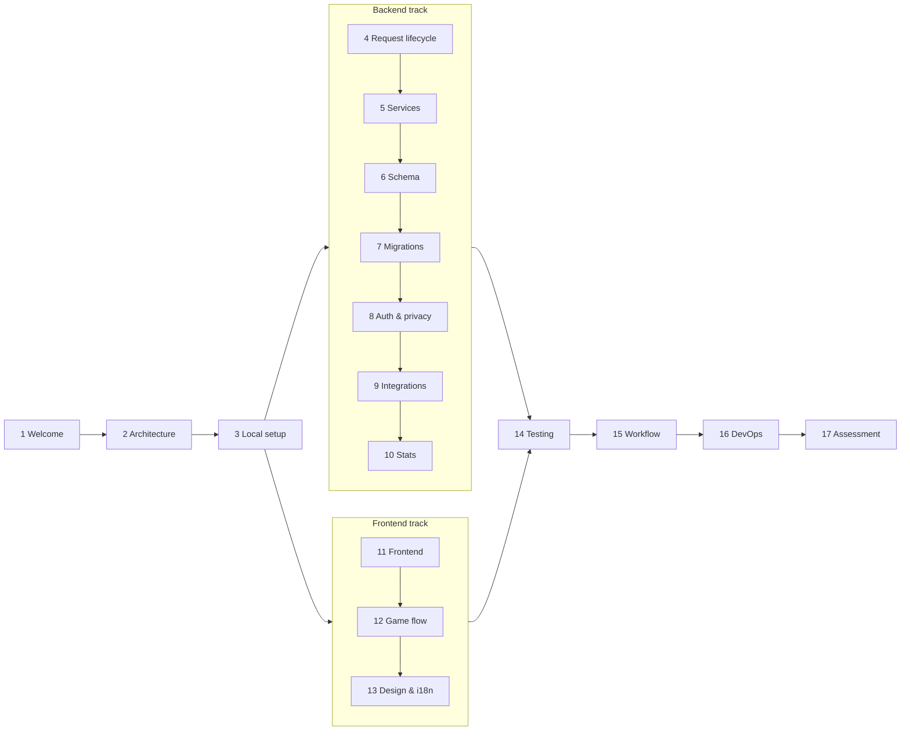

# Svey Developer Onboarding

A self-paced learning path for developers joining Svey. It is modelled on Microsoft Learn courses: each module states its goals, teaches one area of the system with real code from this repository, and ends with a short knowledge check. A final assessment with hands-on labs closes the path.

**Audience:** a developer who is comfortable with TypeScript, a modern frontend framework and SQL, but new to this codebase and possibly to Magic: The Gathering.

**Total time:** about 11–13 hours of reading and exercises, best spread over the first week.

---

## How to use this path

1. Work through the modules in order. Later modules assume the vocabulary from earlier ones.
2. Keep the repository open next to the page. Every module links to the files it discusses; read the real code, not only the excerpts.
3. Do the **Try it** exercises. Most take 5–15 minutes and need only a local setup (Module 3).
4. Answer each **Knowledge check** before expanding the answers. If you miss more than one, re-read the module.
5. Finish with the [final assessment](17-final-assessment.md) and review it with your mentor.

> Excerpts in these pages are trimmed for readability (`// …` marks omissions). When an excerpt and the code disagree, the code wins. Please fix the page in a `docs:` PR.

---

## Learning path

| # | Module | What you'll learn | Time |
|---|---|---|---|
| 1 | [Welcome to Svey](01-welcome-to-svey.md) | The product, the Commander rules it models, the domain vocabulary | 35 min |
| 2 | [Architecture and technical decisions](02-architecture-and-decisions.md) | The system shape, every major technology choice and its trade-offs | 45 min |
| 3 | [Local setup and the first hour](03-local-setup.md) | Run the stack, seed demo data, find your way around | 45 min |
| 4 | [The API request lifecycle](04-api-request-lifecycle.md) | Fastify bootstrap, autoloading, route anatomy, Zod, auth hook, error envelope | 50 min |
| 5 | [Services and authorization](05-services-and-authorization.md) | The service layer, access rules, transactions, side effects | 50 min |
| 6 | [The database schema](06-database-schema.md) | Every table, its relationships, cascades and nullable semantics | 50 min |
| 7 | [Migrations](07-migrations.md) | The migration runner, forward-only rules, the drizzle-kit workflow | 40 min |
| 8 | [Authentication and privacy](08-auth-and-privacy.md) | Better Auth, token encryption, GDPR erasure, data minimisation | 55 min |
| 9 | [Archidekt and Scryfall](09-integrations-archidekt-scryfall.md) | Deck import/sync, bracket estimation, the card-art proxy and cache | 40 min |
| 10 | [Stats and aggregations](10-stats-and-aggregations.md) | Pod standings, deck and player stats, window functions, sharp edges | 50 min |
| 11 | [Frontend architecture](11-frontend-architecture.md) | Router, Pinia stores, the API client, types, PWA | 45 min |
| 12 | [The game session flow](12-game-session-flow.md) | Setup → tracker → survey → saved game, line by line | 60 min |
| 13 | [Design system and i18n](13-design-system-and-i18n.md) | Tailwind tokens, `Sb*` primitives, typed translations | 40 min |
| 14 | [Testing and code quality](14-testing-and-quality.md) | node:test, Vitest, component tests, lint and type gates | 40 min |
| 15 | [Workflow, PRs and releases](15-workflow-and-releases.md) | GitHub flow, Conventional titles, release-please, Dependabot, issues | 35 min |
| 16 | [DevOps and production](16-devops-and-production.md) | Docker images, Compose, Caddy, the deploy pipeline, backups | 55 min |
| 17 | [Final assessment](17-final-assessment.md) | 30 questions across the path plus five hands-on labs | 90 min |



The backend and frontend tracks are independent. A frontend-focused hire can do 11–13 before 4–10, but should still read Module 5 (authorization) and Module 6 (schema) before touching game or stats code.

---

## Progress tracker

Copy this checklist into your onboarding issue and tick items off as you go.

```markdown
- [ ] 1  Welcome to Svey
- [ ] 2  Architecture and technical decisions
- [ ] 3  Local setup (app running, signed in as the demo user)
- [ ] 4  API request lifecycle
- [ ] 5  Services and authorization
- [ ] 6  Database schema
- [ ] 7  Migrations
- [ ] 8  Authentication and privacy
- [ ] 9  Archidekt and Scryfall
- [ ] 10 Stats and aggregations
- [ ] 11 Frontend architecture
- [ ] 12 Game session flow (played a full demo game locally)
- [ ] 13 Design system and i18n
- [ ] 14 Testing and code quality (`pnpm test` green locally)
- [ ] 15 Workflow, PRs and releases
- [ ] 16 DevOps and production
- [ ] 17 Final assessment reviewed with mentor
- [ ] First PR merged
```

---

## Reference material outside this path

| Document | Use it for |
|---|---|
| [README.md](../../README.md) | Product summary, quick start, architecture diagram |
| [CONTRIBUTING.md](../../CONTRIBUTING.md) | The GitHub-flow cycle, PR titles, releases |
| [.claude/CLAUDE.md](../../.claude/CLAUDE.md) | The complete coding conventions (also what the AI assistant follows) |
| [.claude/skills/](../../.claude/skills/) | Step-by-step playbooks: migrations, PRs, issues, releases |
| [apps/api/README.md](../../apps/api/README.md) | API layout and scripts |
| [docs/ops/backup-restore.md](../ops/backup-restore.md) | Backup and restore runbook |

**Keeping this path current:** when a change alters something these pages describe (a convention, a table, a workflow), update the affected module in the same PR, as you would `CLAUDE.md` or a skill.
